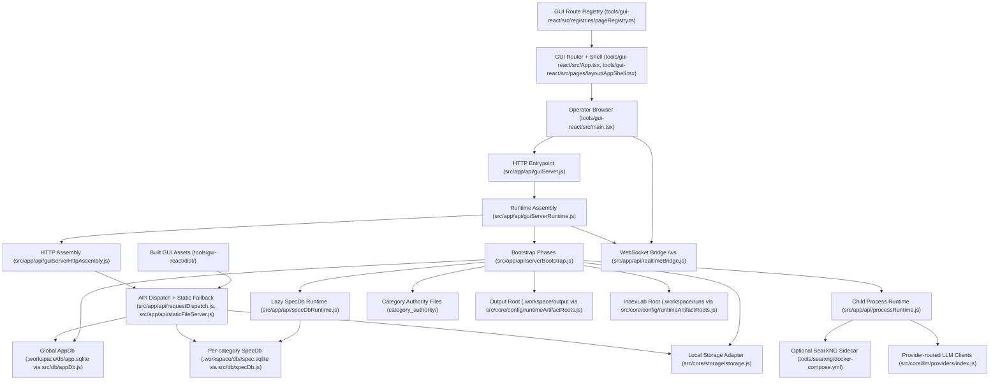

# System Map

> **Purpose:** Show the verified runtime topology, entrypoints, persistence boundaries, and sidecar integrations for the live Spec Factory stack.
> **Prerequisites:** [../02-dependencies/stack-and-toolchain.md](../02-dependencies/stack-and-toolchain.md), [../02-dependencies/environment-and-config.md](../02-dependencies/environment-and-config.md), [../02-dependencies/external-services.md](../02-dependencies/external-services.md)
> **Last validated:** 2026-04-07

## Runtime Topology

## Path Reference List

| Node | Path | Notes |
|------|------|-------|
| Browser entrypoint | `tools/gui-react/src/main.tsx` | React root with tooltip provider and theme hydration |
| GUI router | `tools/gui-react/src/App.tsx` | `HashRouter`, `QueryClientProvider`, registry-driven lazy routes |
| GUI route registry | `tools/gui-react/src/registries/pageRegistry.ts` | SSOT for tabbed routes |
| Shared shell | `tools/gui-react/src/pages/layout/AppShell.tsx` | top-level layout and hydration gate |
| HTTP entrypoint | `src/app/api/guiServer.js` | boots runtime and starts server |
| Runtime assembly | `src/app/api/guiServerRuntime.js` | API route SSOT via `routeDefinitions` |
| Bootstrap phases | `src/app/api/serverBootstrap.js` | env, DB, realtime, process, domain boot |
| HTTP assembly | `src/app/api/guiServerHttpAssembly.js` | builds registered route handlers and request handler |
| Dispatch layer | `src/app/api/requestDispatch.js` | CORS, API detection, static fallback, error envelope |
| Static file server | `src/app/api/staticFileServer.js` | serves `tools/gui-react/dist/` |
| WebSocket bridge | `src/app/api/realtimeBridge.js` | `/ws` upgrade, broadcast fanout, screencast frame cache |
| Process runtime | `src/app/api/processRuntime.js` | child-process lifecycle and SearXNG orchestration |
| Global AppDb | `src/db/appDb.js` | eager global SQLite database |
| Lazy SpecDb runtime | `src/app/api/specDbRuntime.js` | per-category DB open, seed, reseed, reconcile |
| Per-category SpecDb | `src/db/specDb.js` | category-scoped SQLite composition root |
| Category authority root | `category_authority/` | file-backed control plane and generated artifacts |
| Runtime roots | `src/core/config/runtimeArtifactRoots.js` | `.workspace/output`, `.workspace/runs`, settings root defaults |
| Storage adapter | `src/core/storage/storage.js` | currently local backend |
| SearXNG compose stack | `tools/searxng/docker-compose.yml` | optional sidecar search engine |
| LLM provider boundary | `src/core/llm/providers/index.js` | provider registry for routed model calls |

## Topology Notes

- The GUI and API are served by the same Node process. The repo does not contain a separate deployed frontend service.
- The GUI route SSOT is `tools/gui-react/src/registries/pageRegistry.ts`. The API route SSOT is the `routeDefinitions` array in `src/app/api/guiServerRuntime.js` (15 mounted families).
- `src/app/api/requestDispatch.js` treats only `/health` and `/api/v1/*` as API traffic. Everything else falls through to `src/app/api/staticFileServer.js`.
- `src/app/api/realtimeBridge.js` is now a WebSocket bridge plus screencast-frame cache. `setupWatchers()` currently returns `null`; the older file-watcher model is not active.
- Persistent state is split across:
  - global AppDb at `.workspace/db/app.sqlite`
  - per-category SpecDb files at `.workspace/db/<category>/spec.sqlite`
  - file-backed authority content in `category_authority/`
  - runtime artifacts in `.workspace/output` and `.workspace/runs`
- Observed runtime smoke on 2026-04-07 through `createGuiServerRuntime()` confirmed:
  - `GET /health` returns `200`
  - `GET /api/v1/categories` returns category slugs
  - `GET /api/v1/process/status` returns a process snapshot
  - `GET /api/v1/storage/overview` reports `storage_backend: "local"`

## Validated Against

| Source | Path | What was verified |
|--------|------|-------------------|
| source | `src/app/api/guiServer.js` | thin HTTP entrypoint role |
| source | `src/app/api/guiServerRuntime.js` | runtime assembly, metadata roots, and mounted route SSOT |
| source | `src/app/api/serverBootstrap.js` | bootstrap phase order and grouped runtime shape |
| source | `src/app/api/guiServerHttpAssembly.js` | route-handler registration and HTTP assembly |
| source | `src/app/api/requestDispatch.js` | API detection, 404/500 behavior, and static fallback |
| source | `src/app/api/staticFileServer.js` | built-asset serving behavior |
| source | `src/app/api/realtimeBridge.js` | `/ws` handling and no-op watcher setup |
| source | `src/app/api/processRuntime.js` | child-process runtime and SearXNG orchestration |
| source | `src/app/api/specDbRuntime.js` | lazy SpecDb open, seed, reseed, and reconcile behavior |
| source | `src/db/appDb.js` | eager AppDb composition root |
| source | `src/db/specDb.js` | per-category SpecDb composition root |
| source | `tools/gui-react/src/App.tsx` | router shell and lazy route mounting |
| source | `tools/gui-react/src/registries/pageRegistry.ts` | GUI route registry |
| config | `tools/searxng/docker-compose.yml` | optional SearXNG sidecar definition |

## Related Documents

- [Backend Architecture](./backend-architecture.md) - Server boot, route families, and request pipeline details.
- [Frontend Architecture](./frontend-architecture.md) - Browser-side routing, state, and fetch boundaries.
- [Data Model](./data-model.md) - AppDb and SpecDb persistence details behind this topology.
- [Integration Boundaries](../06-references/integration-boundaries.md) - External systems and failure edges connected to this topology.
