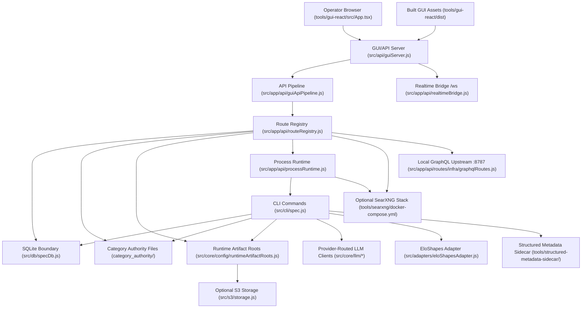

# System Map

> **Purpose:** Show the verified runtime topology and file-backed relationships between the GUI, API server, workers, storage, and optional external services.
> **Prerequisites:** [../02-dependencies/stack-and-toolchain.md](../02-dependencies/stack-and-toolchain.md), [../02-dependencies/external-services.md](../02-dependencies/external-services.md)
> **Last validated:** 2026-03-23

## Path Reference List

| Node | Path |
|------|------|
| Operator browser router | `tools/gui-react/src/App.tsx` |
| Built GUI assets | `tools/gui-react/dist` |
| HTTP/WebSocket server | `src/api/guiServer.js` |
| API pipeline | `src/app/api/guiApiPipeline.js` |
| Route registry | `src/app/api/routeRegistry.js` |
| WebSocket bridge | `src/app/api/realtimeBridge.js` |
| Process runtime | `src/app/api/processRuntime.js` |
| CLI entrypoint | `src/cli/spec.js` |
| SQLite boundary | `src/db/specDb.js` |
| Authority content root | `category_authority/` |
| S3 abstraction | `src/s3/storage.js` |
| SearXNG stack | `tools/searxng/docker-compose.yml` |
| GraphQL proxy | `src/app/api/routes/infra/graphqlRoutes.js` |
| LLM routing boundary | `src/core/llm/client/routing.js` |

## Topology Notes

- The browser only talks to the local Node runtime; the GUI is not a separately deployed frontend service in the checked-in repo.
- `src/api/guiServer.js` is both the API host and static-file host for the built GUI assets.
- WebSocket traffic goes through `/ws` and is backed by `src/app/api/realtimeBridge.js`.
- Background/indexing work is launched through `src/app/api/processRuntime.js`, which shells into the CLI entrypoint in `src/cli/spec.js`.
- Canonical persistent state is split between SQLite (`src/db/`) and the category authority content root.
- The default local artifact roots are under the OS temp directory (`.../spec-factory/output` and `.../spec-factory/indexlab`), not a checked-in top-level `storage/` folder.

## Validated Against

| Source | Path | What was verified |
|--------|------|-------------------|
| source | `src/api/guiServer.js` | main runtime wiring between server, routes, storage, and process runtime |
| source | `src/app/api/guiApiPipeline.js` | API pipeline composition |
| source | `src/app/api/routeRegistry.js` | route registrar inventory and order |
| source | `src/app/api/realtimeBridge.js` | WebSocket upgrade and watcher-backed broadcasts |
| source | `src/app/api/processRuntime.js` | child-process runtime, SearXNG control, and CLI launch boundary |

## Related Documents

- [Backend Architecture](./backend-architecture.md) - Details the request and process pipeline.
- [Frontend Architecture](./frontend-architecture.md) - Explains the browser-side portion of this map.
- [Integration Boundaries](../06-references/integration-boundaries.md) - Explains the optional external edges in this topology.
