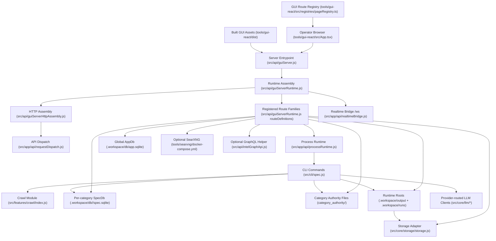

# System Map

> **Purpose:** Show the verified runtime topology and file-backed relationships between the GUI, API server, workers, storage, and optional external services.
> **Prerequisites:** [../02-dependencies/stack-and-toolchain.md](../02-dependencies/stack-and-toolchain.md), [../02-dependencies/external-services.md](../02-dependencies/external-services.md)
> **Last validated:** 2026-03-31

## Path Reference List

| Node | Path |
|------|------|
| Browser entry shell | `tools/gui-react/src/App.tsx` |
| GUI route registry | `tools/gui-react/src/registries/pageRegistry.ts` |
| Built GUI assets | `tools/gui-react/dist/` |
| Thin server entrypoint | `src/api/guiServer.js` |
| Runtime assembly SSOT | `src/api/guiServerRuntime.js` |
| HTTP assembly | `src/api/guiServerHttpAssembly.js` |
| API dispatch | `src/app/api/requestDispatch.js` |
| Realtime bridge | `src/app/api/realtimeBridge.js` |
| Process runtime | `src/app/api/processRuntime.js` |
| CLI entrypoint | `src/cli/spec.js` |
| Crawl module | `src/features/crawl/index.js` |
| Global AppDb | `src/db/appDb.js` |
| Per-category SpecDb | `src/db/specDb.js` |
| Authority content root | `category_authority/` |
| Runtime artifact roots | `src/core/config/runtimeArtifactRoots.js` |
| Storage adapter | `src/core/storage/storage.js` |
| Storage manager routes | `src/features/indexing/api/storageManagerRoutes.js` |
| SearXNG stack | `tools/searxng/docker-compose.yml` |
| GraphQL helper API | `src/api/intelGraphApi.js` |
| GraphQL proxy | `src/app/api/routes/infra/graphqlRoutes.js` |
| LLM routing boundary | `src/core/llm/client/routing.js` |

## Topology Notes

- The browser talks only to the local Node runtime in the current architecture; the GUI is not deployed as a separate service in this repo.
- `tools/gui-react/src/registries/pageRegistry.ts` is the GUI route SSOT; `tools/gui-react/src/App.tsx` mounts registry-derived routes plus standalone `/test-mode`.
- `src/api/guiServerRuntime.js` is the server-route SSOT. The mounted route order comes from its `routeDefinitions` array.
- Persistent state is split between:
  - global AppDb tables in `.workspace/db/app.sqlite`
  - per-category SpecDb files in `.workspace/db/<category>/spec.sqlite`
  - file-backed control-plane content in `category_authority/`
- `src/features/indexing/api/storageManagerRoutes.js` reports `storage_backend: "local"` and `backend_detail.root_path = indexLabRoot` for the `/storage/*` inventory surface.
- Default runtime roots are `.workspace/output` and `.workspace/runs`, not the checked-in `storage/` folder.

## Validated Against

| Source | Path | What was verified |
|--------|------|-------------------|
| source | `src/api/guiServerRuntime.js` | routeDefinitions, runtime assembly, and metadata roots |
| source | `src/api/guiServer.js` | thin runtime entrypoint |
| source | `src/api/guiServerHttpAssembly.js` | route context handoff into HTTP assembly |
| source | `src/app/api/requestDispatch.js` | API dispatch pipeline |
| source | `src/app/api/realtimeBridge.js` | WebSocket handling and file watchers |
| source | `src/app/api/processRuntime.js` | child-process runtime and SearXNG control |
| source | `src/api/bootstrap/createBootstrapSessionLayer.js` | AppDb bootstrap location |
| source | `src/api/bootstrap/createBootstrapEnvironment.js` | workspace roots and live storage adapter bootstrap |
| source | `src/features/indexing/api/storageManagerRoutes.js` | storage-manager backend reporting surface |
| source | `tools/gui-react/src/App.tsx` | browser entry shell |
| source | `tools/gui-react/src/registries/pageRegistry.ts` | browser route registry |

## Related Documents

- [Backend Architecture](./backend-architecture.md) - Request pipeline and route-family details.
- [Frontend Architecture](./frontend-architecture.md) - Browser-side composition details.
- [Integration Boundaries](../06-references/integration-boundaries.md) - External and sidecar edges in this topology.
