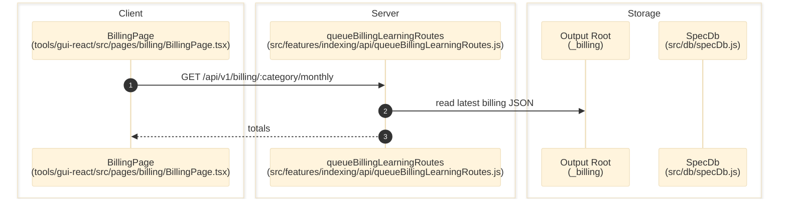

# Billing

> **Purpose:** Document the verified cost artifact surfaces exposed after indexing activity completes.
> **Prerequisites:** [indexing-lab.md](./indexing-lab.md), [../03-architecture/data-model.md](../03-architecture/data-model.md)
> **Last validated:** 2026-04-07

## Entry Points

| Surface | Path | Role |
|--------|------|------|
| Billing page | `tools/gui-react/src/pages/billing/BillingPage.tsx` | cost rollups |
| Queue/Billing API | `src/features/indexing/api/queueBillingLearningRoutes.js` | `/billing/:category/monthly` |
| Billing ledger | `src/billing/costLedger.js` | aggregates LLM billing rows |

## Dependencies

- `src/db/specDb.js`
- `src/billing/costLedger.js`
- output folder `_billing/{category}` beneath the output root

## Flow

1. Indexing or review-related LLM work records cost/billing details into `billing_entries` and/or monthly JSON artifacts.
2. `tools/gui-react/src/pages/billing/BillingPage.tsx` requests `/api/v1/billing/:category/monthly`.
3. `src/features/indexing/api/queueBillingLearningRoutes.js` reads the latest monthly billing JSON.
4. The GUI renders aggregate totals and per-model cost.

## Side Effects

- Runtime generation writes or updates `billing_entries` and output-root artifact files.
- The GUI/API read path is read-only.

## Error Paths

- Missing billing files: route returns `{ totals: {} }` rather than failing.

## State Transitions

| Surface | Transition |
|---------|------------|
| Billing totals | zero/absent -> populated month summary |

## Diagram

## Validated Against

| Source | Path | What was verified |
|--------|------|-------------------|
| source | `src/features/indexing/api/queueBillingLearningRoutes.js` | billing read endpoint |
| source | `src/billing/costLedger.js` | cost ledger ownership |
| source | `tools/gui-react/src/pages/billing/BillingPage.tsx` | GUI usage of billing endpoint |
| schema | `src/db/specDbSchema.js` | `billing_entries` table |

## Related Documents

- [Indexing Lab](./indexing-lab.md) - Billing data is produced by indexing runs.
- [Data Model](../03-architecture/data-model.md) - Lists the underlying billing tables.
