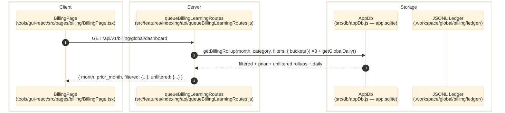

# Billing

> **Purpose:** Document the verified cost artifact surfaces exposed after indexing activity completes.
> **Prerequisites:** [indexing-lab.md](./indexing-lab.md), [../03-architecture/data-model.md](../03-architecture/data-model.md)
> **Last validated:** 2026-04-13

## Entry Points

| Surface | Path | Role |
|--------|------|------|
| Billing page | `tools/gui-react/src/pages/billing/BillingPage.tsx` | dashboard orchestrator (KPI, charts, filters, call log) |
| Billing feature | `tools/gui-react/src/features/billing/` | registry, transforms, queries, components |
| Global billing API | `src/features/indexing/api/queueBillingLearningRoutes.js` | 6 global endpoints + legacy per-category |
| Billing ledger | `src/billing/costLedger.js` | dual-write: SQL (appDb) + JSONL |
| Billing store | `src/db/appDb.js` | `billing_entries` table in global `app.sqlite` |

## Dependencies

- `src/db/appDb.js` (global `app.sqlite` — billing_entries table)
- `src/billing/costLedger.js` (dual-write entry point)
- `.workspace/global/billing/ledger/{month}.jsonl` (durable memory / rebuild source)
- `.workspace/global/billing/monthly/{month}.txt` (digest artifacts)

## API Endpoints

| Method | Path | Purpose |
|--------|------|---------|
| GET | `/api/v1/billing/global/dashboard?category=&model=&reason=&access=&month=&prior_month=&months=1` | Bundle endpoint — current-month filtered + unfiltered rollups + prior-month summary + daily breakdown in one payload (drives the BillingPage) |
| GET | `/api/v1/billing/global/entries?limit=&offset=&category=&model=&reason=` | Paginated raw entries |
| GET | `/api/v1/billing/global/model-costs?month=` | Registry-owned model cost catalog (gated by Model Costs dialog) |
| GET | `/api/v1/billing/{category}/monthly` | Per-category rollup (legacy) |

## Flow

1. LLM calls complete and invoke `onUsage` callback.
2. `costLedger.appendCostLedgerEntry({ config, appDb, entry })` dual-writes:
   - SQL: `appDb.insertBillingEntry()` into global `app.sqlite`
   - JSONL: append to `.workspace/global/billing/ledger/{month}.jsonl`
3. Frontend issues a single `GET /api/v1/billing/global/dashboard` request (plus `entries` per page change and `model-costs` when the dialog opens).
4. The dashboard route calls `appDb.getBillingRollup()` three times (filtered, prior-month, unfiltered) using the `buckets` option to skip wasted GROUP BY queries, plus `appDb.getGlobalDaily()`.
5. GUI renders KPIs, charts, donuts, bars, and the call-log table from the bundle payload.

## Rebuild Contract

If `app.sqlite` is deleted, `seedBillingFromJsonl()` in `appDbSeed.js` restores `billing_entries` from JSONL on next bootstrap.

## Side Effects

- Runtime LLM calls write to both `app.sqlite` and JSONL (dual-state mandate).
- The GUI/API read path is read-only.

## Error Paths

- Missing appDb: route returns `503 { error: 'billing not available' }`.
- Empty data: route returns `{ totals: {} }` or empty arrays.

## State Transitions

| Surface | Transition |
|---------|------------|
| Billing totals | zero/absent -> populated month summary |

## Diagram

## Validated Against

| Source | Path | What was verified |
|--------|------|-------------------|
| source | `src/features/indexing/api/queueBillingLearningRoutes.js` | 3 global (dashboard, entries, model-costs) + 1 legacy `/billing/{category}/monthly` |
| source | `src/billing/costLedger.js` | dual-write (SQL + JSONL) |
| source | `src/db/appDb.js` | billing methods on global AppDb |
| source | `src/db/appDbSchema.js` | `billing_entries` table DDL |
| source | `tools/gui-react/src/pages/billing/BillingPage.tsx` | GUI usage of billing endpoint |

## Related Documents

- [Indexing Lab](./indexing-lab.md) - Billing data is produced by indexing runs.
- [Data Model](../03-architecture/data-model.md) - Lists the underlying billing tables.
