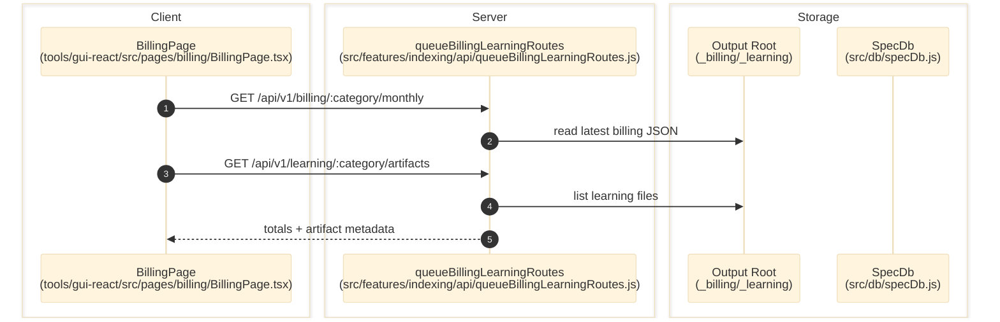

# Billing And Learning

> **Purpose:** Document the verified cost and learning artifact surfaces exposed after indexing activity completes.
> **Prerequisites:** [indexing-lab.md](./indexing-lab.md), [../03-architecture/data-model.md](../03-architecture/data-model.md)
> **Last validated:** 2026-03-23

## Entry Points

| Surface | Path | Role |
|--------|------|------|
| Billing page | `tools/gui-react/src/pages/billing/BillingPage.tsx` | cost rollups and learning artifact list |
| Queue/Billing/Learning API | `src/features/indexing/api/queueBillingLearningRoutes.js` | `/billing/:category/monthly`, `/learning/:category/artifacts` |
| Billing ledger | `src/billing/costLedger.js` | aggregates LLM billing rows |
| Learning writers | `src/features/indexing/learning/*` | learning profiles and suggestion artifacts |

## Dependencies

- `src/db/specDb.js`
- `src/billing/costLedger.js`
- `src/features/indexing/learning/categoryBrain.js`
- output folders `_billing/{category}` and `_learning/{category}` beneath the output root

## Flow

1. Indexing or review-related LLM work records cost/billing details into `billing_entries` and/or monthly JSON artifacts.
2. Learning passes update `learning_profiles`, `category_brain`, and `_learning/{category}` files.
3. `tools/gui-react/src/pages/billing/BillingPage.tsx` requests `/api/v1/billing/:category/monthly` and `/api/v1/learning/:category/artifacts`.
4. `src/features/indexing/api/queueBillingLearningRoutes.js` reads the latest monthly billing JSON and enumerates the learning artifact directory.
5. The GUI renders aggregate totals, per-model cost, and a file list of learning artifacts.

## Side Effects

- Runtime generation writes or updates `billing_entries`, `learning_profiles`, `category_brain`, and output-root artifact files.
- The GUI/API read path is read-only.

## Error Paths

- Missing billing files: route returns `{ totals: {} }` rather than failing.
- Missing learning directory: route returns an empty artifact list.

## State Transitions

| Surface | Transition |
|---------|------------|
| Billing totals | zero/absent -> populated month summary |
| Learning profile | no profile -> accumulated run history and parser-health averages |
| Learning artifacts dir | empty -> artifact file set for category |

## Diagram

## Validated Against

| Source | Path | What was verified |
|--------|------|-------------------|
| source | `src/features/indexing/api/queueBillingLearningRoutes.js` | billing and learning read endpoints |
| source | `src/billing/costLedger.js` | cost ledger ownership |
| source | `tools/gui-react/src/pages/billing/BillingPage.tsx` | GUI usage of billing/learning endpoints |
| schema | `src/db/specDbSchema.js` | `billing_entries`, `learning_profiles`, and `category_brain` tables |

## Related Documents

- [Indexing Lab](./indexing-lab.md) - Billing and learning data are produced by indexing runs.
- [Data Model](../03-architecture/data-model.md) - Lists the underlying billing and learning tables.
