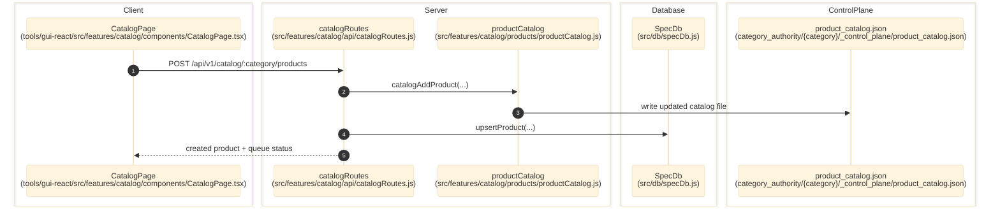

# Catalog And Product Selection

> **Purpose:** Trace the verified category, product, brand, and queue-seeding flow from the GUI to catalog storage and SpecDb mirrors.
> **Prerequisites:** [../03-architecture/data-model.md](../03-architecture/data-model.md), [../03-architecture/routing-and-gui.md](../03-architecture/routing-and-gui.md)
> **Last validated:** 2026-03-15

## Entry Points

| Surface | Path | Role |
|--------|------|------|
| Catalog page | `tools/gui-react/src/features/catalog/components/CatalogPage.tsx` | product CRUD, queue seed, and catalog views |
| Category manager | `tools/gui-react/src/features/catalog/components/CategoryManager.tsx` | category creation and catalog switching |
| Catalog API | `src/features/catalog/api/catalogRoutes.js` | `/catalog/*`, `/product/*`, `/events/*` |
| Brand API | `src/features/catalog/api/brandRoutes.js` | `/brands/*` CRUD and rename cascade |
| Catalog service boundary | `src/features/catalog/index.js` | canonical product identity and catalog helpers |

## Dependencies

- `src/features/catalog/products/productCatalog.js`
- `src/features/catalog/identity/brandRegistry.js`
- `src/features/catalog/products/reconciler.js`
- `src/queue/queueState.js`
- `src/db/specDb.js`
- `category_authority/{category}/_control_plane/product_catalog.json`

## Flow

1. A user adds or edits a product in `tools/gui-react/src/features/catalog/components/CatalogPage.tsx`.
2. The GUI calls `POST`, `PUT`, or `DELETE` on `/api/v1/catalog/:category/products` through `tools/gui-react/src/api/client.ts`.
3. `src/features/catalog/api/catalogRoutes.js` delegates to `catalogAddProduct`, `catalogUpdateProduct`, `catalogRemoveProduct`, or bulk/seed helpers.
4. Catalog helpers update `product_catalog.json` under `category_authority/{category}/_control_plane/` and may queue the product through `upsertQueueProduct()`.
5. The route mirrors the catalog state into SQLite via `specDb.upsertProduct()` or delete helpers when SpecDb is available.
6. The route emits `data-change` events so review, indexing, and studio screens refresh cached product lists.
7. Brand rename/delete actions in `src/features/catalog/api/brandRoutes.js` cascade into catalog rows, queue state, and SpecDb product mirrors.

## Side Effects

- Writes `product_catalog.json` and brand registry artifacts.
- Writes `products` and `product_queue` rows in SQLite when SpecDb is ready.
- Emits `catalog-*` and `brand-*` data-change events.
- `POST /catalog/:category/products/seed` can enqueue many products in one operation.

## Error Paths

- Duplicate products: `409 product_already_exists`.
- Unknown product on update/delete: `404`.
- Bulk limits over `5000` rows: `400 too_many_rows`.
- Brand delete while still referenced: `409 brand_in_use`.

## State Transitions

| Entity | Transition |
|--------|------------|
| Product catalog row | absent -> active row -> updated row -> removed |
| Queue row | absent -> queued/pending -> retried/paused/requeued |
| Brand slug | original slug -> renamed slug with cascaded product ids |

## Diagram

## Validated Against

| Source | Path | What was verified |
|--------|------|-------------------|
| source | `src/features/catalog/api/catalogRoutes.js` | Product CRUD, seed, reconcile, and events endpoints |
| source | `src/features/catalog/api/brandRoutes.js` | Brand CRUD and rename cascade behavior |
| source | `src/features/catalog/README.md` | Catalog feature boundary and invariants |
| source | `tools/gui-react/src/features/catalog/components/CatalogPage.tsx` | GUI entrypoints |

## Related Documents

- [Review Workbench](./review-workbench.md) - Review payloads only serve catalog-backed or SpecDb-backed products.
- [Storage and Run Data](./storage-and-run-data.md) - Product detail pages read latest run artifacts from output storage.
