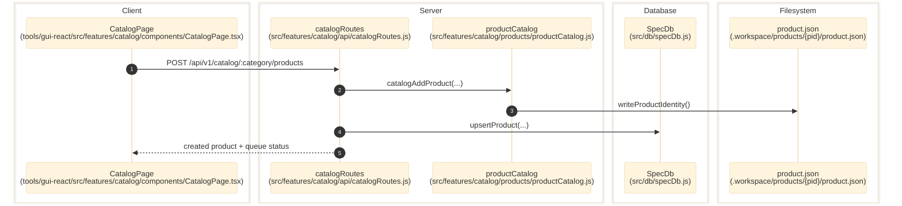

# Catalog And Product Selection

> **Purpose:** Trace the verified category, product, brand, and queue-seeding flow from the GUI to SQL storage and per-product rebuild files.
> **Prerequisites:** [../03-architecture/data-model.md](../03-architecture/data-model.md), [../03-architecture/routing-and-gui.md](../03-architecture/routing-and-gui.md)
> **Last validated:** 2026-03-31

## Entry Points

| Surface | Path | Role |
|--------|------|------|
| Catalog page | `tools/gui-react/src/features/catalog/components/CatalogPage.tsx` | product CRUD, queue seed, and catalog views |
| Category manager | `tools/gui-react/src/features/catalog/components/CategoryManager.tsx` | category creation and catalog switching |
| Catalog API | `src/features/catalog/api/catalogRoutes.js` | `/catalog/*`, `/product/*`, `/events/*` |
| Brand API | `src/features/catalog/api/brandRoutes.js` | `/brands/*` CRUD and rename cascade |
| Catalog service boundary | `src/features/catalog/index.js` | canonical product identity and catalog helpers |

## Dependencies

- `src/features/catalog/products/productCatalog.js`
- `src/features/catalog/products/upsertCatalogProductRow.js` - SpecDb product row upsert
- `src/features/catalog/products/writeProductIdentity.js` - writes `.workspace/products/{pid}/product.json`
- `src/features/catalog/identity/brandRegistry.js`
- `src/features/catalog/products/reconciler.js`
- `src/features/catalog/contracts/catalogShapes.js` - Zod-style shape descriptors for catalog/brand responses
- `src/queue/queueState.js`
- `src/db/specDb.js`

## SSOT

- **SQL `products` table** in `spec.sqlite` is the live queryable SSOT for product identity.
- **`.workspace/products/{pid}/product.json`** is the per-product rebuild file (created at add time, grown after runs).
- **`product_catalog.json`** is a read-only boot seed — read at first startup to populate an empty SQL database. Never mutated on CRUD.
- **No fixture input files** — the `fixtures/` directory and `INPUT_KEY_PREFIX` pattern have been eliminated.

## Flow

1. A user adds or edits a product in `CatalogPage.tsx`.
2. The GUI calls `POST`, `PUT`, or `DELETE` on `/api/v1/catalog/:category/products`.
3. `catalogRoutes.js` delegates to `catalogAddProduct`, `catalogUpdateProduct`, `catalogRemoveProduct`, or bulk/seed helpers.
4. `productCatalog.js` creates `.workspace/products/{pid}/product.json` via `writeProductIdentity()` and queues the product.
5. The route mirrors identity into SQLite via `upsertCatalogProductRow()`.
6. The route emits `data-change` events so review, indexing, and studio screens refresh.
7. Brand rename/delete actions cascade into SQL product rows and queue state.

## Side Effects

- Writes `.workspace/products/{pid}/product.json` (rebuild SSOT).
- Writes `products` and `product_queue` rows in SQLite.
- Emits `catalog-*` and `brand-*` data-change events.
- `POST /catalog/:category/products/seed` can enqueue many products in one operation.

## Error Paths

- Duplicate products: `409 product_already_exists`.
- Unknown product on update/delete: `404`.
- Bulk limits over `5000` rows: `400 too_many_rows`.
- Brand delete while still referenced: `409 brand_in_use`.

## State Transitions

| Entity | Transition |
|--------|------------|
| Product SQL row | absent -> active -> updated -> deleted |
| Product.json | absent -> created (at add) -> grown (after runs) |
| Queue row | absent -> queued/pending -> retried/paused/requeued |
| Brand slug | original slug -> renamed slug with cascaded product ids |

## Diagram

## Validated Against

| Source | Path | What was verified |
|--------|------|-------------------|
| source | `src/features/catalog/api/catalogRoutes.js` | Product CRUD, seed, reconcile, and events endpoints |
| source | `src/features/catalog/api/brandRoutes.js` | Brand CRUD and rename cascade behavior |
| source | `src/features/catalog/README.md` | Catalog feature boundary and invariants |
| source | `tools/gui-react/src/features/catalog/components/CatalogPage.tsx` | GUI entrypoints |

## Related Documents

- [Review Workbench](./review-workbench.md) - Review payloads only serve catalog-backed or SpecDb-backed products.
- [Storage and Run Data](./storage-and-run-data.md) - Product detail pages read latest run artifacts from output storage.
