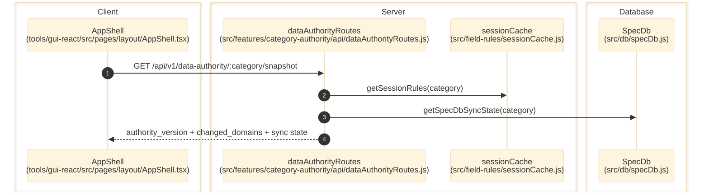

# Category Authority

> **Purpose:** Document the verified authority snapshot flow and the artifact roots that represent per-category control-plane truth.
> **Prerequisites:** [../03-architecture/data-model.md](../03-architecture/data-model.md), [../03-architecture/routing-and-gui.md](../03-architecture/routing-and-gui.md)
> **Last validated:** 2026-03-15

## Entry Points

| Surface | Path | Role |
|--------|------|------|
| HTTP snapshot route | `src/features/category-authority/api/dataAuthorityRoutes.js` | serves `/api/v1/data-authority/:category/snapshot` |
| Category artifacts root | `category_authority/{category}/` | authored/generated authority files consumed by runtime loaders |
| Session cache consumer | `src/field-rules/sessionCache.js` | merges compiled rules, map state, and timestamps used by the snapshot |
| GUI authority helpers | `tools/gui-react/src/hooks/authoritySnapshotHelpers.js`, `tools/gui-react/src/pages/layout/AppShell.tsx` | consume authority version/data-change state to invalidate client caches |

## Dependencies

- `src/features/category-authority/api/dataAuthorityRoutes.js`
- `src/observability/dataPropagationCounters.js`
- `src/observability/settingsPersistenceCounters.js`
- `src/features/settings-authority/index.js`
- `src/db/specDb.js`

## Flow

1. A GUI surface selects or switches to a category in `tools/gui-react/src/pages/layout/AppShell.tsx`.
2. Client helpers request `/api/v1/data-authority/:category/snapshot` through `tools/gui-react/src/api/client.ts`.
3. `src/features/category-authority/api/dataAuthorityRoutes.js` pulls session timestamps from `sessionCache.getSessionRules(category)`.
4. The route reads SpecDb sync state via `getSpecDb(category)?.getSpecDbSyncState(category)`.
5. The route combines session state, SpecDb sync state, and observability counters into a single payload with `buildAuthoritySnapshotPayload()`.
6. The GUI uses the returned `authority_version`, `changed_domains`, and `compile_stale` fields to decide which caches or tabs need refresh.

## Side Effects

- The snapshot request itself is read-only.
- Indirect upstream writes that change the snapshot come from studio saves, compile runs, and SpecDb sync actions.

## Error Paths

- `authoritySnapshotEnabled` disabled in config: route family returns `false`; no snapshot endpoint is exposed.
- Missing or invalid category: `400 { error: 'category_required' }`.
- Missing SpecDb sync state: route falls back to default `unknown` sync metadata instead of failing.

## State Transitions

| State | Trigger | Result |
|-------|---------|--------|
| `compile_stale=false` | compile output current | review/layout consumers can trust generated authority artifacts |
| `compile_stale=true` | studio map/rules drift | downstream consumers know generated outputs are out of date |
| `last_sync_status=unknown/failed/ok` | SpecDb seed/sync activity | GUI can detect whether SQLite mirrors authority artifacts |

## Diagram

## Validated Against

| Source | Path | What was verified |
|--------|------|-------------------|
| source | `src/features/category-authority/api/dataAuthorityRoutes.js` | Snapshot payload assembly and route contract |
| source | `src/field-rules/sessionCache.js` | Session-derived timestamps and compile-stale state |
| source | `tools/gui-react/src/hooks/authoritySnapshotHelpers.js` | GUI authority snapshot consumption |
| source | `tools/gui-react/src/pages/layout/AppShell.tsx` | Category-scoped invalidation integration |

## Related Documents

- [Field Rules Studio](./field-rules-studio.md) - Studio writes are a primary cause of authority-version changes.
- [Pipeline and Runtime Settings](./pipeline-and-runtime-settings.md) - User settings persistence changes authority-adjacent state.