# Color Registry

> **Purpose:** Document the verified global color registry CRUD flow plus the per-product color and edition discovery flow.
> **Prerequisites:** [../03-architecture/data-model.md](../03-architecture/data-model.md), [../03-architecture/routing-and-gui.md](../03-architecture/routing-and-gui.md), [indexing-lab.md](./indexing-lab.md)
> **Last validated:** 2026-04-04

## Entry Points

| Surface | Path | Role |
|--------|------|------|
| Global colors page | `tools/gui-react/src/features/color-registry/components/ColorRegistryPage.tsx` | renders `/colors`, lists registry rows, and runs CRUD mutations |
| Color CRUD routes | `src/features/color-registry/api/colorRoutes.js` | serves `GET/POST/PUT/DELETE /api/v1/colors` |
| Color route bootstrap | `src/app/api/guiServerRuntime.js`, `src/features/color-registry/api/colorRouteContext.js` | injects `appDb`, `broadcastWs`, and `colorRegistryPath` into the color route family |
| Color registry bootstrap seed | `src/app/api/bootstrap/createBootstrapSessionLayer.js`, `src/features/color-registry/colorRegistrySeed.js` | seeds AppDb from `category_authority/_global/color_registry.json` or defaults |
| Finder panel | `tools/gui-react/src/features/color-edition-finder/components/ColorEditionFinderPanel.tsx` | embedded on `tools/gui-react/src/features/indexing/components/IndexingPage.tsx` for one selected product |
| Finder query hooks | `tools/gui-react/src/features/color-edition-finder/api/colorEditionFinderQueries.ts` | reads and mutates `/api/v1/color-edition-finder/*` |
| Finder routes | `src/features/color-edition/api/colorEditionFinderRoutes.js` | serves product-scoped color/edition history and run/delete actions |
| Finder orchestrator | `src/features/color-edition/colorEditionFinder.js` | calls the configured LLM, merges JSON history, and upserts SQL summary rows |
| Finder JSON SSOT | `src/features/color-edition/colorEditionStore.js` | persists `.workspace/products/<productId>/color_edition.json` |

## Dependencies

- `src/db/appDbSchema.js` - AppDb `color_registry` table is the canonical mutable store for global colors.
- `category_authority/_global/color_registry.json` - JSON mirror written after color CRUD mutations and read during bootstrap seeding.
- `src/db/specDbSchema.js` - per-category `color_edition_finder` table stores the SQL summary derived from per-product JSON history.
- `src/features/color-edition/colorEditionLlmAdapter.js` - builds the finder prompt and LLM call contract.
- `src/core/llm/buildLlmCallDeps.js` - resolves the configured provider/model runtime used by the finder orchestrator.
- `src/features/indexing/components/IndexingPage.tsx` - owns the product-scoped finder panel mount.

## Flow

### Global Color Registry CRUD

1. The operator opens `/colors`, which loads `tools/gui-react/src/features/color-registry/components/ColorRegistryPage.tsx`.
2. React Query reads `GET /api/v1/colors` through `tools/gui-react/src/api/client.ts`.
3. `src/features/color-registry/api/colorRoutes.js` reads rows from AppDb and returns `{ name, hex, css_var, created_at, updated_at }[]`.
4. `POST /api/v1/colors` validates `name` against `^[a-z][a-z0-9-]*$`, validates `hex` against `^#[0-9a-fA-F]{6}$`, derives `css_var = --color-<name>`, and upserts the row into AppDb.
5. `PUT /api/v1/colors/:name` validates the new `hex` and updates the existing row in AppDb.
6. `DELETE /api/v1/colors/:name` removes the AppDb row when present.
7. Each successful mutation emits a `data-change` event (`color-add`, `color-update`, or `color-delete`) and asynchronously mirrors AppDb back to `category_authority/_global/color_registry.json`.

### Per-Product Color And Edition Discovery

1. The operator selects one product on `tools/gui-react/src/features/indexing/components/IndexingPage.tsx`, which mounts `ColorEditionFinderPanel`.
2. `tools/gui-react/src/features/color-edition-finder/api/colorEditionFinderQueries.ts` reads:
   - `GET /api/v1/color-edition-finder/:category/:productId`
   - `GET /api/v1/colors`
3. `src/features/color-edition/api/colorEditionFinderRoutes.js` reads the SQL summary row from SpecDb and the detailed per-run JSON history from `.workspace/products/<productId>/color_edition.json`.
4. When the user clicks `Run Now`, the panel posts `POST /api/v1/color-edition-finder/:category/:productId`.
5. The route validates that SpecDb is ready, loads the product row, and calls `src/features/color-edition/colorEditionFinder.js`.
6. `runColorEditionFinder()` reads the global color registry from AppDb, reads prior per-product run history from `color_edition.json`, builds the prompt through `src/features/color-edition/colorEditionLlmAdapter.js`, and calls the configured LLM via `src/core/llm/buildLlmCallDeps.js`.
7. The orchestrator appends a new run record to `color_edition.json`, updates top-level `selected` with latest-wins semantics, and upserts the category-local `color_edition_finder` SQL row.
8. The route emits `data-change` events such as `color-edition-finder-run`, `color-edition-finder-run-deleted`, or `color-edition-finder-deleted`, and the panel re-queries both the product history and the global color list.

## Side Effects

- AppDb `color_registry` rows are inserted, updated, or deleted.
- `category_authority/_global/color_registry.json` is rewritten after successful color CRUD mutations.
- `.workspace/products/<productId>/color_edition.json` is created, appended, recalculated, or deleted.
- SpecDb `color_edition_finder` rows are inserted, updated, or deleted.
- WebSocket `data-change` broadcasts notify the GUI about color and color-edition mutations.

## Error Paths

- `POST /api/v1/colors` returns:
  - `400 invalid_name`
  - `400 name_too_long`
  - `400 invalid_hex`
- `PUT /api/v1/colors/:name` returns `404 not_found` for unknown color names and `400 invalid_hex` for malformed hex values.
- `DELETE /api/v1/colors/:name` returns `404 not_found` when the row does not exist.
- Color edition routes return `503 { error: 'specDb not ready' }` until the category SpecDb is opened and seeded.
- `POST /api/v1/color-edition-finder/:category/:productId` returns `404 { error: 'product not found' }` for unknown products and `500 { error: 'finder failed', message }` when the orchestrator throws.
- `DELETE /api/v1/color-edition-finder/:category/:productId/runs/:runNumber` returns `400 { error: 'invalid run number' }` for non-positive or non-numeric run identifiers.

## State Transitions

| Surface | Trigger | Result |
|---------|---------|--------|
| AppDb color registry | `POST/PUT/DELETE /api/v1/colors` | `color_registry` row set mutates and JSON mirror write-back is queued |
| Color registry JSON mirror | successful CRUD mutation | `category_authority/_global/color_registry.json` is regenerated from AppDb |
| Finder selected state | `POST /api/v1/color-edition-finder/:category/:productId` | latest run becomes the new top-level `selected` state in `color_edition.json` |
| Finder run history | `DELETE /api/v1/color-edition-finder/:category/:productId/runs/:runNumber` | remaining runs are recalculated and the SQL summary is updated or removed |
| Finder reset | `DELETE /api/v1/color-edition-finder/:category/:productId` | `color_edition.json` is removed and the SpecDb summary row is deleted |

## Diagram

```mermaid
%%{init: {'theme': 'base', 'themeVariables': { 'fontSize': '20px', 'actorWidth': 250, 'actorMargin': 200, 'boxMargin': 20 }}}%%
sequenceDiagram
  autonumber
  box Client
    participant IndexingPage as IndexingPage<br/>(tools/gui-react/src/features/indexing/components/IndexingPage.tsx)
    participant FinderPanel as ColorEditionFinderPanel<br/>(tools/gui-react/src/features/color-edition-finder/components/ColorEditionFinderPanel.tsx)
  end
  box Server
    participant FinderRoute as colorEditionFinderRoutes<br/>(src/features/color-edition/api/colorEditionFinderRoutes.js)
    participant FinderService as runColorEditionFinder<br/>(src/features/color-edition/colorEditionFinder.js)
    participant ColorRoute as colorRoutes<br/>(src/features/color-registry/api/colorRoutes.js)
  end
  box Persistence
    participant AppDb as app.sqlite<br/>(.workspace/db/app.sqlite)
    participant FinderJson as color_edition.json<br/>(.workspace/products/<productId>/color_edition.json)
    participant SpecDb as spec.sqlite<br/>(.workspace/db/<category>/spec.sqlite)
    participant ColorJson as color_registry.json<br/>(category_authority/_global/color_registry.json)
  end
  IndexingPage->>FinderPanel: select product
  FinderPanel->>ColorRoute: GET /api/v1/colors
  ColorRoute->>AppDb: listColors()
  FinderPanel->>FinderRoute: POST /api/v1/color-edition-finder/:category/:productId
  FinderRoute->>FinderService: runColorEditionFinder(product, appDb, specDb)
  FinderService->>AppDb: listColors()
  FinderService->>FinderJson: append run + selected state
  FinderService->>SpecDb: upsertColorEditionFinder(...)
  FinderRoute-->>FinderPanel: colors + editions + default_color
  ColorRoute->>ColorJson: writeBackColorRegistry()
```

## Validated Against

| Source | Path | What was verified |
|--------|------|-------------------|
| source | `src/app/api/guiServerRuntime.js` | live route mounting, route-context injection, and `_global/color_registry.json` path |
| source | `src/app/api/bootstrap/createBootstrapSessionLayer.js` | AppDb seeding from the global color registry JSON on bootstrap |
| source | `src/db/appDbSchema.js` | `color_registry` table contract |
| source | `src/db/specDbSchema.js` | `color_edition_finder` SQL summary table contract |
| source | `src/features/color-registry/api/colorRoutes.js` | `/colors` CRUD validation and mutation behavior |
| source | `src/features/color-registry/colorRegistrySeed.js` | bootstrap seed + write-back behavior |
| source | `tools/gui-react/src/features/color-registry/components/ColorRegistryPage.tsx` | GUI color CRUD surface and query keys |
| source | `src/features/color-edition/api/colorEditionFinderRoutes.js` | finder read/run/delete endpoint behavior |
| source | `src/features/color-edition/colorEditionFinder.js` | LLM orchestration, JSON merge, and SQL upsert flow |
| source | `src/features/color-edition/colorEditionStore.js` | `color_edition.json` path, latest-wins semantics, and delete recalculation |
| source | `tools/gui-react/src/features/color-edition-finder/api/colorEditionFinderQueries.ts` | GUI query and mutation surface |
| source | `tools/gui-react/src/features/color-edition-finder/components/ColorEditionFinderPanel.tsx` | GUI panel mount, run action, and color-registry dependency |
| source | `tools/gui-react/src/features/indexing/components/IndexingPage.tsx` | product-scoped finder panel entrypoint |

## Related Documents

- [Catalog and Product Selection](./catalog-and-product-selection.md) - products and product identifiers consumed by the color-edition finder are selected here.
- [Indexing Lab](./indexing-lab.md) - the finder panel is mounted on the Indexing page and shares the selected product context.
- [API Surface](../06-references/api-surface.md) - exact `/colors` and `/color-edition-finder/*` endpoint contracts.
