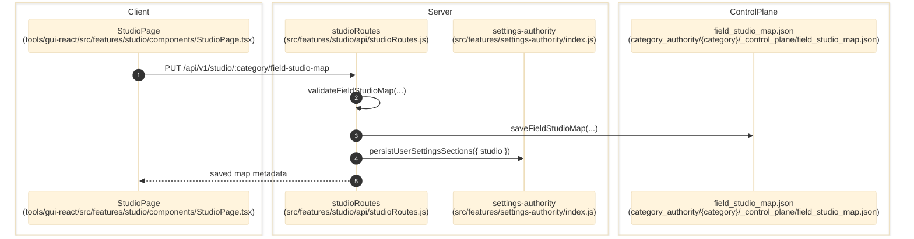

# Field Rules Studio

> **Purpose:** Trace the verified studio authoring flow for field maps, known values, component DB views, compile actions, and cache invalidation.
> **Prerequisites:** [../03-architecture/data-model.md](../03-architecture/data-model.md), [category-authority.md](./category-authority.md)
> **Last validated:** 2026-03-24

## Entry Points

| Surface | Path | Role |
|--------|------|------|
| Studio page | `tools/gui-react/src/features/studio/components/StudioPage.tsx` | interactive field rules/studio UI |
| Studio API | `src/features/studio/api/studioRoutes.js` | `/studio/:category/*` and `/field-labels/:category` |
| Map helpers | `src/features/studio/api/studioRouteHelpers.js` | preferred-map selection, validation, enum consistency helpers |
| User settings persistence | `src/features/settings-authority/index.js` | persists studio map snapshots into `user-settings.json` |

## Dependencies

- `src/ingest/categoryCompile.js`
- `src/field-rules/sessionCache.js`
- `src/features/indexing/index.js`
- `category_authority/{category}/_control_plane/field_studio_map.json`
- `category_authority/{category}/_generated/*.json`

## Flow

1. The user opens `tools/gui-react/src/features/studio/components/StudioPage.tsx`.
2. The page loads `/api/v1/studio/:category/payload`, `/field-labels/:category`, `/studio/:category/field-studio-map`, and optional `/known-values` or `/component-db` surfaces.
3. `src/features/studio/api/studioRoutes.js` resolves the preferred studio map from user settings and control-plane files.
4. A save action sends `PUT /api/v1/studio/:category/field-studio-map`.
5. The route validates the map with `validateFieldStudioMap()`, writes `field_studio_map.json`, and persists a matching studio snapshot into `user-settings.json`.
6. The route emits `field-studio-map-saved` data-change events and invalidates session/review caches.
7. Compile or validate actions call `startProcess('src/cli/spec.js', ['compile-rules' ...])` or `['validate-rules' ...]`, which runs the CLI pipeline and refreshes generated artifacts.

## EG Default Keys (Registry-Driven)

Default field keys (e.g. `colors`, `editions`) are managed by `EG_PRESET_REGISTRY` in `src/features/studio/contracts/egPresets.js`. Adding a new locked default = one builder + one registry entry. All propagation is automatic:

| Layer | When | File |
|-------|------|------|
| Scaffold | New category creation | `src/field-rules/compilerCategoryInit.js` — `buildAllEgDefaults()` |
| Compile | Any `compile-rules` invocation | `src/ingest/compileContextLoader.js` — injects synthetic keyRows + overrides for missing EG keys |
| Studio GET | Payload load | `src/features/studio/api/studioRoutes.js` — backfills missing keys, persists via write-on-read migration |
| Studio PUT | Save | `src/features/studio/api/studioRoutes.js` — `sanitizeEgLockedOverrides()` resets non-editable paths to preset |
| Frontend | Toggle UI | `tools/gui-react/src/features/studio/state/egPresetsClient.ts` — `EG_PRESET_KEYS` derived from registry |

Lock enforcement: only paths listed in `EG_EDITABLE_PATHS` (aliases, search hints, tooltip) can be customized. All other paths are reset to the preset on save. Backfill is lazy — existing categories get defaults on next compile or Studio GET.

## Side Effects

- Writes `category_authority/{category}/_control_plane/field_studio_map.json`.
- Writes the `studio` section inside `.workspace/global/user-settings.json` through settings-authority.
- Invalidates `sessionCache` and `reviewLayoutByCategory`.
- Compile actions refresh generated rule files under `category_authority/{category}/_generated/`.
- Studio payload GET may trigger write-on-read migration for missing EG default keys (persists to SQL + JSON).

## Error Paths

- Invalid map payload: `400 invalid_field_studio_map`.
- Empty overwrite without `allowEmptyOverwrite=true`: `409 empty_map_overwrite_rejected`.
- SpecDb-dependent surfaces (`known-values`, `component-db`) return `503 specdb_not_ready` until seeding completes.
- Starting compile/validate while another process is active returns `409 process_already_running`.

## State Transitions

| State | Trigger | Result |
|-------|---------|--------|
| draft map | user edits UI fields | local page state only |
| validated map | `validate-field-studio-map` | normalized map with warnings/errors |
| persisted map | `PUT field-studio-map` | control-plane file + user settings snapshot updated |
| generated rules refreshed | compile succeeds | session cache timestamps and authority version advance |

## Diagram

## Validated Against

| Source | Path | What was verified |
|--------|------|-------------------|
| source | `src/features/studio/api/studioRoutes.js` | Studio endpoints, save rules, and compile hooks |
| source | `src/features/studio/api/studioRouteHelpers.js` | Preferred-map and enum-consistency behavior |
| source | `src/features/studio/README.md` | Studio invariants |
| source | `tools/gui-react/src/features/studio/components/StudioPage.tsx` | GUI entrypoint |

## Related Documents

- [Category Authority](./category-authority.md) - Studio changes are reflected by the authority snapshot route.
- [Pipeline and Runtime Settings](./pipeline-and-runtime-settings.md) - Studio map persistence shares the same user-settings authority.
