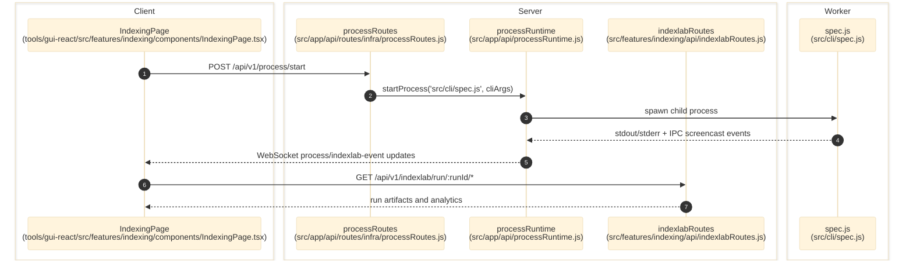

# Indexing Lab

> **Purpose:** Trace the verified end-to-end indexing run flow from GUI launch through process orchestration, artifact generation, and run replay APIs.
> **Prerequisites:** [../03-architecture/backend-architecture.md](../03-architecture/backend-architecture.md), [../03-architecture/routing-and-gui.md](../03-architecture/routing-and-gui.md)
> **Last validated:** 2026-03-23

## Entry Points

| Surface | Path | Role |
|--------|------|------|
| Indexing page | `tools/gui-react/src/features/indexing/components/IndexingPage.tsx` | run creation, run selection, and artifact replay |
| Process launcher | `src/app/api/routes/infra/processRoutes.js` | `/api/v1/process/start|stop|status` |
| Process runtime | `src/app/api/processRuntime.js` | spawns CLI runs and tracks active process state |
| CLI entrypoint | `src/cli/spec.js` | executes `indexlab`, `run-one`, `run-batch`, compile, and daemon flows |
| Replay API | `src/features/indexing/api/indexlabRoutes.js` | serves run meta, needset, search profile, extraction, analytics, and live-crawl reference surfaces |

## Dependencies

- `src/features/crawl/index.js` — crawl session, plugin runner, screenshot capture, block classification
- `src/features/crawl/plugins/stealthPlugin.js`, `autoScrollPlugin.js` — built-in browser automation plugins
- `src/pipeline/runProduct.js` (248 LOC) — crawl-first orchestrator
- `src/pipeline/runCrawlProcessingLifecycle.js` — batch-oriented crawl processing with frontier DB recording
- `src/features/indexing/orchestration/index.js` — bootstrap and discovery orchestration
- `src/features/indexing/discovery/pipelineContextSchema.js` — 8 progressive Zod checkpoints for discovery context validation
- `src/indexlab/needsetEngine.js`
- `src/logger.js`
- `src/db/specDb.js`
- `src/app/api/realtimeBridge.js`
- local IndexLab root from `src/core/config/runtimeArtifactRoots.js`

## Pipeline Architecture (Crawl-First)

The pipeline was reworked from an extraction-heavy monolith to a crawl-first architecture:

- **Before**: fetch → parse → extract (LLM) → verify → consensus → validation → learning export
- **After**: bootstrap → create crawl session → crawl URLs → record to frontier DB

Removed: extraction pipeline, consensus engine, learning gates, evidence audit, field aggregation, identity candidate merging.
Added: `src/features/crawl/` (plugin-based browser automation), frontier DB integration, block detection/bypass.

## Flow

1. The user fills the run form in `tools/gui-react/src/features/indexing/components/IndexingPage.tsx`.
2. The page posts a launch request to `/api/v1/process/start`.
3. `src/app/api/routes/infra/processRoutes.js` builds a launch plan with `buildProcessStartLaunchPlan()` and rejects invalid or incomplete inputs.
4. `src/app/api/processRuntime.js` spawns `node src/cli/spec.js ...` with the computed CLI args and env overrides.
5. `src/pipeline/runProduct.js` bootstraps identity/planner, creates a crawl session with `createCrawlSession({ plugins: [stealthPlugin, autoScrollPlugin] })`, starts the session, and runs `runCrawlProcessingLifecycle()` against the frontier DB.
6. The crawl session opens URLs in a persistent browser, captures screenshots, classifies block status, and records results to the frontier DB.
7. The GUI replays run artifacts through `/api/v1/indexlab/run/:runId/*` endpoints in `src/features/indexing/api/indexlabRoutes.js`.
8. On process exit, `src/api/services/indexLabProcessCompletion.js` finalizes run-data relocation/archive behavior.

## Side Effects

- Writes IndexLab run folders under the configured IndexLab root.
- Writes crawl results and screenshots to frontier DB and output storage.
- Appends runtime telemetry through `EventLogger` to NDJSON and/or `runtime_events` SQLite rows.
- May update queue and billing tables during a run.

## Error Paths

- Missing generated field rules: `409 missing_generated_field_rules` before launch.
- Existing active process with no replacement allowed: `409 process_already_running`.
- Missing run artifacts on replay: `404 run_not_found` or feature-specific `*_not_found` errors.
- If a child process exits with an error event, run meta is normalized to `failed` when replayed.

## State Transitions

| State | Trigger | Result |
|-------|---------|--------|
| no active run | initial idle state | `/process/status` reports `running=false` |
| launching | `/process/start` accepted | process runtime holds pid + run_id |
| running | child CLI active | websocket channels stream logs and events |
| completed/failed | child exits | run meta and relocation handlers finalize artifacts |

## Diagram

## Validated Against

| Source | Path | What was verified |
|--------|------|-------------------|
| source | `src/app/api/routes/infra/processRoutes.js` | launch/stop/status endpoints |
| source | `src/app/api/processRuntime.js` | child process lifecycle |
| source | `src/features/indexing/api/indexlabRoutes.js` | replay/read endpoints |
| source | `src/cli/spec.js` | CLI command ownership |
| source | `tools/gui-react/src/features/indexing/components/IndexingPage.tsx` | GUI run control surface |

## Related Documents

- [Runtime Ops](./runtime-ops.md) - Runtime Ops reads the same run event/artifact surfaces with a worker-centric lens.
- [Storage and Run Data](./storage-and-run-data.md) - Completed run output may be relocated or mirrored after exit.
