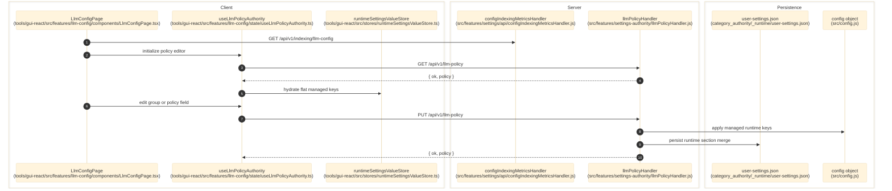

# LLM Policy And Provider Config

> **Purpose:** Document the verified `/llm-config` feature, including the composite `LlmPolicy` shape, provider-registry editing flow, and the `/api/v1/llm-policy` persistence contract.
> **Prerequisites:** [../02-dependencies/environment-and-config.md](../02-dependencies/environment-and-config.md), [../03-architecture/frontend-architecture.md](../03-architecture/frontend-architecture.md), [../03-architecture/backend-architecture.md](../03-architecture/backend-architecture.md)
> **Last validated:** 2026-03-24

## Entry Points

| Surface | Path | Role |
|--------|------|------|
| GUI page | `tools/gui-react/src/features/llm-config/components/LlmConfigPage.tsx` | global LLM policy, provider registry, budget, timeout, token, and per-phase override editor |
| GUI shell | `tools/gui-react/src/features/llm-config/components/LlmConfigPageShell.tsx` | left-nav phase shell for `global`, `needset`, `brand-resolver`, `search-planner`, `serp-selector`, `extraction`, `validate`, and `write` |
| GUI authority hook | `tools/gui-react/src/features/llm-config/state/useLlmPolicyAuthority.ts` | hydrates the composite policy from the flat runtime store and auto-saves to `/api/v1/llm-policy` |
| GUI API client | `tools/gui-react/src/features/llm-config/api/llmPolicyApi.ts` | `GET/PUT /api/v1/llm-policy` |
| Server handler | `src/features/settings-authority/llmPolicyHandler.js` | assemble, validate, persist, and broadcast composite policy changes |
| Policy schema | `src/core/llm/llmPolicySchema.js` | SSOT for composite group assembly/disassembly and managed flat keys |
| Read-only metadata endpoint | `src/features/settings/api/configIndexingMetricsHandler.js` | `GET /api/v1/indexing/llm-config` model catalog, pricing, token-default, and resolved-key metadata |

## Dependencies

- `src/shared/settingsRegistry.js`
- `src/core/llm/llmPolicySchema.js`
- `src/core/llm/llmModelValidation.js`
- `src/features/settings/api/configPersistenceContext.js`
- `src/features/settings-authority/userSettingsService.js`
- `tools/gui-react/src/stores/runtimeSettingsValueStore.ts`
- `tools/gui-react/src/features/llm-config/state/llmPolicyAdapter.generated.ts`
- `tools/gui-react/src/features/llm-config/state/llmPhaseOverridesBridge.ts`
- `tools/gui-react/src/features/llm-config/types/llmProviderRegistryTypes.ts`
- `tools/gui-react/src/features/llm-config/types/llmPhaseOverrideTypes.ts`

## Policy Shape

### Composite `LlmPolicy` Groups

| Group | Fields | Evidence |
|------|--------|----------|
| `models` | `plan`, `reasoning`, `planFallback`, `reasoningFallback` | `src/core/llm/llmPolicySchema.js`, `tools/gui-react/src/features/llm-config/state/llmPolicyAdapter.generated.ts` |
| `provider` | `id`, `baseUrl`, `planProvider`, `planBaseUrl` | `src/core/llm/llmPolicySchema.js` |
| `apiKeys` | `gemini`, `deepseek`, `anthropic`, `openai`, `plan` | `src/core/llm/llmPolicySchema.js` |
| `tokens` | `maxOutput`, `plan`, `planFallback`, `reasoning`, `reasoningFallback`, `maxTokens` | `src/core/llm/llmPolicySchema.js` |
| `reasoning` | `enabled`, `budget`, `mode` | `src/core/llm/llmPolicySchema.js` |
| `budget` | `monthlyUsd`, `perProductUsd`, `costInputPer1M`, `costOutputPer1M`, `costCachedInputPer1M` | `src/core/llm/llmPolicySchema.js` |
| top-level | `timeoutMs` | `src/core/llm/llmPolicySchema.js` |
| JSON payloads | `phaseOverrides`, `providerRegistry` | `src/core/llm/llmPolicySchema.js` |

### Provider Registry Entry Shape

| Field | Type | Notes |
|------|------|-------|
| `id` | `string` | provider identifier such as `default-gemini` |
| `name` | `string` | operator-facing label |
| `type` | `openai-compatible / anthropic / ollama` | transport/provider family |
| `baseUrl` | `string` | provider API base |
| `apiKey` | `string` | persisted or injected API key |
| `enabled` | `boolean` | disabled providers are excluded from client validation |
| `expanded` | `boolean` | GUI-only expansion state persisted in the registry JSON |
| `health` | `'green' | 'gray' | 'red'` | optional operator-facing status badge |
| `models` | `LlmProviderModel[]` | nested model catalog with `modelId`, costs, token caps, tier, and transport |

### Phase Override Shape

| Field | Type | Notes |
|------|------|-------|
| `baseModel` | `string` | phase-local base model override |
| `reasoningModel` | `string` | phase-local reasoning-model override |
| `useReasoning` | `boolean` | phase-local toggle over the global reasoning setting |
| `maxOutputTokens` | `number \| null` | phase-local token cap override |

`tools/gui-react/src/features/llm-config/state/llmPhaseOverridesBridge.ts` maps GUI tab IDs such as `search-planner` and `brand-resolver` onto stored override keys such as `searchPlanner` and `brandResolver`.

## Flow

1. The operator opens `/llm-config`, which renders `tools/gui-react/src/features/llm-config/components/LlmConfigPage.tsx`.
2. The page fetches `GET /api/v1/indexing/llm-config` through `tools/gui-react/src/api/client.ts` to hydrate model options, pricing defaults, routing snapshots, token profiles, and resolved API keys.
3. `tools/gui-react/src/features/llm-config/state/useLlmPolicyAuthority.ts` fetches `GET /api/v1/llm-policy`, receives `{ ok, policy }`, flattens the composite shape, and hydrates `tools/gui-react/src/stores/runtimeSettingsValueStore.ts`.
4. GUI edits call `updateGroup()` or `updatePolicy()`, which flatten the edited group back into flat runtime keys in the shared store. No separate local policy store is the source of truth.
5. Auto-save or "Save Now" calls `PUT /api/v1/llm-policy` through `tools/gui-react/src/features/llm-config/api/llmPolicyApi.ts`.
6. `src/features/settings-authority/llmPolicyHandler.js` disassembles the composite object into flat keys, validates model IDs against the provider registry, applies accepted values to the live config object, merges only managed policy keys into the runtime section, and persists through `src/features/settings/api/configPersistenceContext.js`.
7. The handler emits `runtime-settings-updated` and `user-settings-updated` broadcasts, reassembles the now-live policy, and returns `{ ok: true, policy }`.
8. On success, `useLlmPolicyAuthority()` marks the runtime store clean and publishes runtime settings propagation to downstream GUI consumers.

## Side Effects

- Updates managed runtime keys inside the live server config object.
- Persists the managed policy keys back into `category_authority/_runtime/user-settings.json`.
- Reuses the shared runtime settings store instead of maintaining a second LLM-only store.
- Preserves unrelated runtime keys by merging only `LLM_POLICY_FLAT_KEYS`.
- Broadcasts `data-change` events for runtime/settings consumers.

## Error Paths

- Client preflight rejects model IDs that are not present in any enabled provider in `providerRegistry` using `tools/gui-react/src/features/llm-config/state/llmModelValidation.ts`.
- Server validation rejects invalid model IDs with `422 { ok: false, error: 'invalid_model', rejected }` from `src/features/settings-authority/llmPolicyHandler.js`.
- Canonical persistence failure returns `500 { ok: false, error: 'llm_policy_persist_failed' }`.
- Empty strings are accepted for model fallback fields; the server skips validation for blank values.

## State Transitions

| Entity | Transition |
|--------|------------|
| Composite policy | fetched composite -> flattened shared-store values -> edited composite -> persisted runtime keys -> reassembled server snapshot |
| Provider registry | registry JSON -> editable `LlmProviderEntry[]` -> saved `llmProviderRegistryJson` |
| Phase overrides | per-tab edits -> override-key mapping -> serialized `llmPhaseOverridesJson` |
| API keys | runtime/store values plus resolved server keys -> edited provider credentials -> persisted managed runtime keys |

## Diagram

## Validated Against

| Source | Path | What was verified |
|--------|------|-------------------|
| source | `tools/gui-react/src/features/llm-config/components/LlmConfigPage.tsx` | page composition, phase tabs, save/reset behavior, and shared-store adapters |
| source | `tools/gui-react/src/features/llm-config/components/LlmConfigPageShell.tsx` | phase-shell routing and scope badge |
| source | `tools/gui-react/src/features/llm-config/state/useLlmPolicyAuthority.ts` | fetch/hydrate/save flow and shared-store ownership |
| source | `tools/gui-react/src/features/llm-config/api/llmPolicyApi.ts` | `/llm-policy` client contract |
| source | `tools/gui-react/src/features/llm-config/state/llmPolicyAdapter.generated.ts` | generated composite type and managed flat-key mapping |
| source | `tools/gui-react/src/features/llm-config/state/llmPhaseOverridesBridge.ts` | GUI-tab to override-key mapping |
| source | `tools/gui-react/src/features/llm-config/types/llmProviderRegistryTypes.ts` | provider registry data shape |
| source | `tools/gui-react/src/features/llm-config/types/llmPhaseOverrideTypes.ts` | phase override data shape |
| source | `src/features/settings-authority/llmPolicyHandler.js` | server read/write, validation, persistence, and broadcasts |
| source | `src/core/llm/llmPolicySchema.js` | composite schema and managed flat-key list |
| source | `src/core/llm/llmModelValidation.js` | server model-registry validation |
| source | `src/features/settings/api/configIndexingMetricsHandler.js` | read-only LLM metadata endpoint used by the GUI |

## Related Documents

- [Pipeline and Runtime Settings](./pipeline-and-runtime-settings.md) - Separate feature for flat runtime settings, source strategy, and category route matrices.
- [Routing and GUI](../03-architecture/routing-and-gui.md) - Maps `/llm-config` and `/llm-settings` to their separate page owners.
- [API Surface](../06-references/api-surface.md) - Lists the exact `/llm-policy` and `/indexing/llm-config` contracts.
