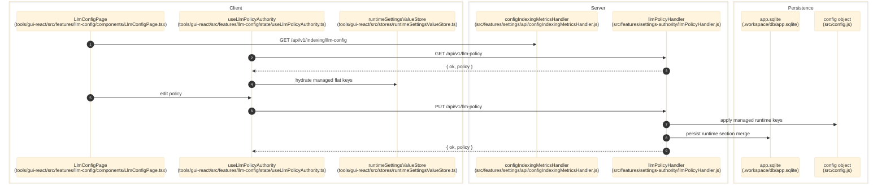

# LLM Policy And Provider Config

> **Purpose:** Document the verified `/llm-config` feature, including the composite `LlmPolicy` shape, provider-registry editing flow, and the `/api/v1/llm-policy` persistence contract.
> **Prerequisites:** [../02-dependencies/environment-and-config.md](../02-dependencies/environment-and-config.md), [../03-architecture/frontend-architecture.md](../03-architecture/frontend-architecture.md), [../03-architecture/backend-architecture.md](../03-architecture/backend-architecture.md)
> **Last validated:** 2026-04-07

## Entry Points

| Surface | Path | Role |
|--------|------|------|
| GUI page | `tools/gui-react/src/features/llm-config/components/LlmConfigPage.tsx` | global LLM policy, provider registry, budget, timeout, token, and phase override editor |
| GUI shell | `tools/gui-react/src/features/llm-config/components/LlmConfigPageShell.tsx` | left-nav shell for phase-local editing |
| GUI authority hook | `tools/gui-react/src/features/llm-config/state/useLlmPolicyAuthority.ts` | hydrates the composite policy from the flat runtime store and auto-saves to `/api/v1/llm-policy` |
| GUI API client | `tools/gui-react/src/features/llm-config/api/llmPolicyApi.ts` | `GET/PUT /api/v1/llm-policy` |
| server handler | `src/features/settings-authority/llmPolicyHandler.js` | assemble, validate, persist, and broadcast composite policy changes |
| policy schema | `src/core/llm/llmPolicySchema.js` | SSOT for composite group assembly/disassembly and managed flat keys |
| metadata endpoint | `src/features/settings/api/configIndexingMetricsHandler.js` | `GET /api/v1/indexing/llm-config` model catalog, pricing, token profiles, and resolved API keys |

## Dependencies

- `src/shared/settingsRegistry.js`
- `src/core/llm/llmPolicySchema.js`
- `src/core/llm/llmModelValidation.js`
- `src/features/settings/api/configPersistenceContext.js`
- `src/features/settings-authority/userSettingsService.js`
- `tools/gui-react/src/stores/runtimeSettingsValueStore.ts`
- `tools/gui-react/src/features/llm-config/state/llmPolicyAdapter.generated.ts`
- `tools/gui-react/src/features/llm-config/state/llmPhaseOverridesBridge.generated.ts`
- `tools/gui-react/src/features/llm-config/types/llmProviderRegistryTypes.ts`
- `tools/gui-react/src/features/llm-config/types/llmPhaseOverrideTypes.generated.ts`

## Policy Shape

### Composite `LlmPolicy` groups

| Group | Fields | Evidence |
|------|--------|----------|
| `models` | `plan`, `reasoning`, `planFallback`, `reasoningFallback` | `src/core/llm/llmPolicySchema.js` |
| `provider` | `id`, `baseUrl`, `planProvider`, `planBaseUrl` | `src/core/llm/llmPolicySchema.js` |
| `apiKeys` | `gemini`, `deepseek`, `anthropic`, `openai`, `plan` | `src/core/llm/llmPolicySchema.js` |
| `tokens` | `maxOutput`, `plan`, `planFallback`, `reasoning`, `reasoningFallback`, `maxTokens` | `src/core/llm/llmPolicySchema.js` |
| `reasoning` | `enabled`, `budget`, `mode` | `src/core/llm/llmPolicySchema.js` |
| `budget` | `monthlyUsd`, `perProductUsd`, `costInputPer1M`, `costOutputPer1M`, `costCachedInputPer1M` | `src/core/llm/llmPolicySchema.js` |
| top-level | `timeoutMs` | `src/core/llm/llmPolicySchema.js` |
| JSON payloads | `phaseOverrides`, `providerRegistry` | `src/core/llm/llmPolicySchema.js` |

### Provider registry entry shape

| Field | Type | Notes |
|------|------|-------|
| `id` | `string` | provider identifier such as `default-gemini` |
| `name` | `string` | operator-facing label |
| `type` | `openai-compatible`, `anthropic`, or `ollama` | transport/provider family |
| `baseUrl` | `string` | provider API base |
| `apiKey` | `string` | provider credential field returned by `/llm-policy` when configured |
| `enabled` | `boolean` | disabled providers are excluded from client validation |
| `models` | `LlmProviderModel[]` | nested model catalog with costs and token caps |

### Phase override shape

| Field | Type | Notes |
|------|------|-------|
| `baseModel` | `string` | phase-local base model override |
| `reasoningModel` | `string` | phase-local reasoning-model override |
| `useReasoning` | `boolean` | phase-local toggle over the global reasoning setting |
| `maxOutputTokens` | `number \| null` | phase-local token cap override |

## Flow

1. The operator opens `/llm-config`, which renders `tools/gui-react/src/features/llm-config/components/LlmConfigPage.tsx`.
2. The page fetches `GET /api/v1/indexing/llm-config` to hydrate model options, pricing defaults, routing snapshots, token profiles, and `resolved_api_keys`.
3. `useLlmPolicyAuthority()` fetches `GET /api/v1/llm-policy`, receives `{ ok, policy }`, and hydrates managed flat keys into `runtimeSettingsValueStore`.
4. The page merges default provider definitions, persisted provider-registry rows, and server-resolved API keys so provider cards show active credentials even when the stored registry omits them.
5. GUI edits update the shared flat runtime store through adapter helpers rather than maintaining a second LLM-only state store.
6. Auto-save or explicit save calls `PUT /api/v1/llm-policy`.
7. `src/features/settings-authority/llmPolicyHandler.js` disassembles the composite object into flat keys, validates model IDs against the provider registry, applies accepted values to the live config object, merges only managed keys into the runtime section, and persists through `configPersistenceContext`.
8. The handler emits settings broadcasts, reassembles the now-live policy, and returns `{ ok: true, policy }`.

## Side Effects

- Updates managed runtime keys in the live server config object.
- Persists managed policy keys into AppDb `settings` rows, with JSON fallback only when AppDb is unavailable.
- Reuses the shared flat runtime settings store instead of maintaining a second canonical LLM store.
- Preserves unrelated runtime keys by persisting only `LLM_POLICY_FLAT_KEYS`.
- Broadcasts `runtime-settings-updated` and `user-settings-updated`.

## Error Paths

- Client preflight rejects model IDs not present in any enabled provider in the current registry.
- Server validation rejects invalid model IDs with `422 { ok: false, error: 'invalid_model', rejected }`.
- Canonical persistence failure returns `500 { ok: false, error: 'llm_policy_persist_failed' }`.
- Empty strings are accepted for optional fallback model fields.

## Security Note

- `GET /api/v1/runtime-settings` is also unauthenticated and exposes the same managed provider API key fields because the flat runtime store is the underlying source for this feature.
- `GET /api/v1/llm-policy` is unauthenticated and returns provider-registry `apiKey` fields when configured.
- `GET /api/v1/indexing/llm-config` is unauthenticated and returns `resolved_api_keys` when configured.
- The GUI deliberately consumes those responses to prefill provider credential state. Treat this entire feature as trusted-network-only until an auth-hardening task changes the contract.

## State Transitions

| Entity | Transition |
|--------|------------|
| composite policy | fetched composite -> flattened shared-store values -> edited composite -> persisted managed runtime keys -> reassembled server snapshot |
| provider registry | merged defaults and persisted rows -> editable `LlmProviderEntry[]` -> saved `llmProviderRegistryJson` |
| phase overrides | per-tab edits -> override-key mapping -> serialized `llmPhaseOverridesJson` |
| API keys | server-resolved keys plus runtime-store values -> edited provider credentials -> persisted managed runtime keys |

## Diagram

## Validated Against

| Source | Path | What was verified |
|--------|------|-------------------|
| source | `tools/gui-react/src/features/llm-config/components/LlmConfigPage.tsx` | page composition, provider-registry merging, and resolved-key consumption |
| source | `tools/gui-react/src/features/llm-config/components/LlmConfigPageShell.tsx` | phase-shell composition |
| source | `tools/gui-react/src/features/llm-config/state/useLlmPolicyAuthority.ts` | fetch/hydrate/save flow and shared-store ownership |
| source | `tools/gui-react/src/features/llm-config/api/llmPolicyApi.ts` | `/llm-policy` client contract |
| source | `src/features/settings-authority/llmPolicyHandler.js` | server read/write, validation, persistence, and broadcasts |
| source | `src/core/llm/llmPolicySchema.js` | composite schema and managed flat-key list |
| source | `src/core/llm/llmModelValidation.js` | server model-registry validation |
| source | `src/features/settings/api/configIndexingMetricsHandler.js` | `/indexing/llm-config` metadata and resolved-key response shape |

## Related Documents

- [Pipeline and Runtime Settings](./pipeline-and-runtime-settings.md) - Separate feature for flat runtime settings and category route matrices.
- [Routing and GUI](../03-architecture/routing-and-gui.md) - Maps `/llm-config` and `/llm-settings` to their separate page owners.
- [API Surface](../06-references/api-surface.md) - Exact `/llm-policy` and `/indexing/llm-config` contracts.
