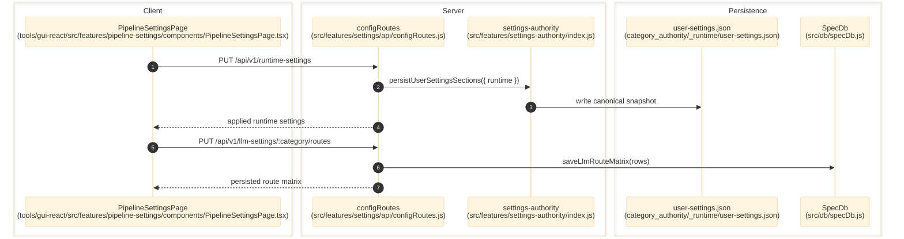

# Pipeline And Runtime Settings

> **Purpose:** Document the verified settings persistence flow for runtime, convergence, UI, storage, and LLM-route controls.
> **Prerequisites:** [../02-dependencies/environment-and-config.md](../02-dependencies/environment-and-config.md), [../03-architecture/backend-architecture.md](../03-architecture/backend-architecture.md)
> **Last validated:** 2026-03-23

## Entry Points

| Surface | Path | Role |
|--------|------|------|
| Pipeline settings page | `tools/gui-react/src/features/pipeline-settings/components/PipelineSettingsPage.tsx` | runtime + convergence settings editor |
| LLM settings page | `tools/gui-react/src/pages/llm-settings/LlmSettingsPage.tsx` | category-scoped route matrix editor |
| Settings API | `src/features/settings/api/configRoutes.js` | `/ui-settings`, `/runtime-settings`, `/convergence-settings`, `/storage-settings`, `/llm-settings/*` |
| Settings authority | `src/features/settings-authority/index.js` | canonical settings schema, migration, validation, persistence |

## Dependencies

- `src/features/settings-authority/settingsContract.js`
- `src/features/settings-authority/userSettingsService.js`
- `src/shared/settingsRegistry.js` — SSOT registry defining 430+ settings across runtime, convergence, UI, and storage domains
- `src/shared/settingsDefaults.js` — derived defaults from the registry
- `src/shared/settingsAccessor.js` — null-safe accessor with registry clamping
- `src/api/services/runDataRelocationService.js`
- `src/db/specDb.js`
- `category_authority/_runtime/user-settings.json`

## Flow

1. The GUI loads current settings from `/api/v1/runtime-settings`, `/convergence-settings`, `/ui-settings`, and `/storage-settings`.
2. Category-scoped LLM routing uses `/api/v1/llm-settings/:category/routes`.
3. `src/features/settings/api/configRoutes.js` validates and normalizes incoming payloads against route contracts exported from `src/features/settings-authority/index.js`.
4. `persistUserSettingsSections()` writes canonical updates into `user-settings.json`.
5. `applyRuntimeSettingsToConfig()` and `applyConvergenceSettingsToConfig()` project persisted values back into the live in-memory config object.
6. The route emits `data-change` events such as `runtime-settings-updated` and `user-settings-updated`.
7. LLM route matrix writes persist directly into SQLite through `specDb.saveLlmRouteMatrix(rows)`.

## Side Effects

- Writes canonical settings to `category_authority/_runtime/user-settings.json`.
- Optionally writes legacy compatibility files in `_runtime/` if canonical-only writes are disabled.
- Mutates the live server config object so subsequent runs use the updated settings immediately.
- Updates `llm_route_matrix` rows in SQLite for category route-matrix changes.

## Error Paths

- Invalid storage payload: `400` with a specific validation message.
- Invalid integer/float/enum settings: key is rejected and reported in the response.
- Missing SpecDb for LLM settings: `500 specdb_unavailable`.
- Persistence failures: `500 *_persist_failed`.

## State Transitions

| Surface | Transition |
|---------|------------|
| UI settings | in-memory toggle -> persisted UI snapshot |
| Runtime/convergence settings | request payload -> normalized snapshot -> live config mutation |
| LLM route matrix | fetched rows -> edited rows -> persisted SQLite rows |

## Diagram

## Validated Against

| Source | Path | What was verified |
|--------|------|-------------------|
| source | `src/features/settings/api/configRoutes.js` | settings endpoints and persistence behavior |
| source | `src/features/settings-authority/README.md` | settings-authority invariants |
| source | `src/features/settings-authority/index.js` | exported contracts and helpers |
| source | `tools/gui-react/src/features/pipeline-settings/components/PipelineSettingsPage.tsx` | primary GUI settings surface |
| source | `tools/gui-react/src/pages/llm-settings/LlmSettingsPage.tsx` | LLM route matrix GUI surface |

## Related Documents

- [Storage and Run Data](./storage-and-run-data.md) - Storage settings are a subset of this persistence flow but affect run artifact destinations.
- [Category Authority](./category-authority.md) - Persisted settings influence authority snapshots and cache invalidation.
