# Pipeline And Runtime Settings

> **Purpose:** Document the verified runtime-settings, source-strategy, and deterministic spec-seed surfaces.
> **Prerequisites:** [../02-dependencies/environment-and-config.md](../02-dependencies/environment-and-config.md), [../03-architecture/backend-architecture.md](../03-architecture/backend-architecture.md), [llm-policy-and-provider-config.md](./llm-policy-and-provider-config.md)
> **Last validated:** 2026-04-17

This document covers the settings surfaces owned by `PipelineSettingsPage`, including the deterministic spec-seed editor mounted inside pipeline settings. The separate `/llm-config` composite policy editor is documented in [llm-policy-and-provider-config.md](./llm-policy-and-provider-config.md).

## Entry Points

| Surface | Path | Role |
|--------|------|------|
| Pipeline settings page | `tools/gui-react/src/features/pipeline-settings/components/PipelineSettingsPage.tsx` | runtime settings, source strategy, and deterministic spec-seed editor |
| deterministic strategy section | `tools/gui-react/src/features/pipeline-settings/sections/PipelineDeterministicStrategySection.tsx` | per-category spec-seed editor |
| settings API | `src/features/settings/api/configRoutes.js` | `/runtime-settings`, `/indexing/llm-config` |
| source strategy API | `src/features/indexing/api/sourceStrategyRoutes.js` | `/source-strategy/*` per-category source policy |
| spec seeds API | `src/features/indexing/api/specSeedsRoutes.js` | `/spec-seeds?category=:category` deterministic query-template persistence |

## Dependencies

- `src/features/settings/api/configRuntimeSettingsHandler.js`
- `src/features/settings/api/configPersistenceContext.js`
- `src/features/settings-authority/userSettingsService.js`
- `src/features/indexing/api/sourceStrategyRoutes.js`
- `src/features/indexing/api/specSeedsRoutes.js`
- `src/features/indexing/sources/sourceFileService.js`
- `src/features/indexing/sources/specSeedsFileService.js`
- `src/shared/settingsRegistry.js`
- `src/shared/settingsDefaults.js`
- `src/db/specDb.js`
- `tools/gui-react/src/features/pipeline-settings/state/sourceStrategyAuthority.ts`
- `tools/gui-react/src/features/pipeline-settings/state/specSeedsAuthority.ts`
- `tools/gui-react/src/stores/runtimeSettingsValueStore.ts`

## Flow

1. `tools/gui-react/src/features/pipeline-settings/components/PipelineSettingsPage.tsx` hydrates runtime settings from `GET /api/v1/runtime-settings`.
2. The same page reads `GET /api/v1/indexing/llm-config` for model and token metadata used by runtime settings helpers.
3. `tools/gui-react/src/features/pipeline-settings/state/sourceStrategyAuthority.ts` calls `/api/v1/source-strategy` for per-category source entries stored in `category_authority/<category>/sources.json`.
4. `tools/gui-react/src/features/pipeline-settings/state/specSeedsAuthority.ts` calls `GET/PUT /api/v1/spec-seeds?category=:category` for ordered deterministic query templates stored in `category_authority/<category>/spec_seeds.json`.
5. `src/features/settings/api/configRuntimeSettingsHandler.js` validates and persists runtime patches through `configPersistenceContext`.
6. `configPersistenceContext` writes canonical runtime sections into AppDb when available and applies accepted values back into the live config object.

There is no live `/api/v1/storage-settings` route in this flow.
There is no live `/api/v1/convergence-settings` route in this flow.

## Side Effects

- Updates live runtime config values through `applyRuntimeSettingsToConfig()`.
- Persists canonical runtime settings into AppDb `settings` rows, with JSON fallback only when AppDb is unavailable.
- Writes per-category source strategy into `category_authority/<category>/sources.json`.
- Writes per-category deterministic query templates into `category_authority/<category>/spec_seeds.json`.
- Emits `data-change` broadcasts such as `runtime-settings-updated`, `user-settings-updated`, and source/spec-seed update events.

## Error Paths

- Invalid runtime key or type: key is rejected in the response envelope.
- Missing or unresolved `category` query param for `/source-strategy` or `/spec-seeds`: `400 category_required`.
- Invalid deterministic spec seeds: `400 invalid_spec_seeds` with a concrete reason.
- Persistence failures return route-specific `500 *_persist_failed` errors.

## State Transitions

| Surface | Transition |
|---------|------------|
| runtime settings | request payload -> normalized snapshot -> persisted AppDb row set -> live config mutation |
| source strategy | form entry -> `sources.json` update -> reloaded source entry list |
| spec seeds | ordered template edits -> `spec_seeds.json` update -> future deterministic query list |

## Diagram

```mermaid
%%{init: {'theme': 'base', 'themeVariables': { 'fontSize': '20px', 'actorWidth': 250, 'actorMargin': 200, 'boxMargin': 20 }}}%%
sequenceDiagram
  autonumber
  box Client
    participant PipelinePage as PipelineSettingsPage<br/>(tools/gui-react/src/features/pipeline-settings/components/PipelineSettingsPage.tsx)
    participant SourceHook as sourceStrategyAuthority<br/>(tools/gui-react/src/features/pipeline-settings/state/sourceStrategyAuthority.ts)
    participant SeedsHook as specSeedsAuthority<br/>(tools/gui-react/src/features/pipeline-settings/state/specSeedsAuthority.ts)
  end
  box Server
    participant RuntimeRoutes as runtimeSettingsHandler<br/>(src/features/settings/api/configRuntimeSettingsHandler.js)
    participant SourceRoutes as sourceStrategyRoutes<br/>(src/features/indexing/api/sourceStrategyRoutes.js)
    participant SeedRoutes as specSeedsRoutes<br/>(src/features/indexing/api/specSeedsRoutes.js)
  end
  box Persistence
    participant AppDb as app.sqlite<br/>(.workspace/db/app.sqlite)
    participant SourcesFile as sources.json<br/>(category_authority/<category>/sources.json)
    participant SeedsFile as spec_seeds.json<br/>(category_authority/<category>/spec_seeds.json)
  end
  PipelinePage->>RuntimeRoutes: PUT /api/v1/runtime-settings
  RuntimeRoutes->>AppDb: persist runtime section
  PipelinePage->>SourceHook: edit source strategy
  SourceHook->>SourceRoutes: POST/PUT/DELETE /api/v1/source-strategy
  SourceRoutes->>SourcesFile: write source entries
  SeedsHook->>SeedRoutes: PUT /api/v1/spec-seeds?category=:category
  SeedRoutes->>SeedsFile: write deterministic seeds
```

## Validated Against

| Source | Path | What was verified |
|--------|------|-------------------|
| source | `src/features/settings/api/configRoutes.js` | live settings endpoint split |
| source | `src/features/settings/api/configRuntimeSettingsHandler.js` | runtime settings read/write behavior |
| source | `src/features/settings/api/configPersistenceContext.js` | AppDb-first runtime persistence |
| source | `src/features/indexing/api/sourceStrategyRoutes.js` | source-strategy read/write surface |
| source | `src/features/indexing/api/specSeedsRoutes.js` | deterministic spec-seed read/write surface |
| source | `src/features/indexing/sources/sourceFileService.js` | file-backed source strategy behavior |
| source | `src/features/indexing/sources/specSeedsFileService.js` | file-backed spec seeds behavior |
| source | `tools/gui-react/src/features/pipeline-settings/components/PipelineSettingsPage.tsx` | primary GUI settings surface |

## Related Documents

- [LLM Policy and Provider Config](./llm-policy-and-provider-config.md) - Separate composite `/llm-policy` feature.
- [Storage and Run Data](./storage-and-run-data.md) - Separate storage-manager inventory surface.
- [Category Authority](./category-authority.md) - Source strategy and spec seeds live under the same control-plane root.
