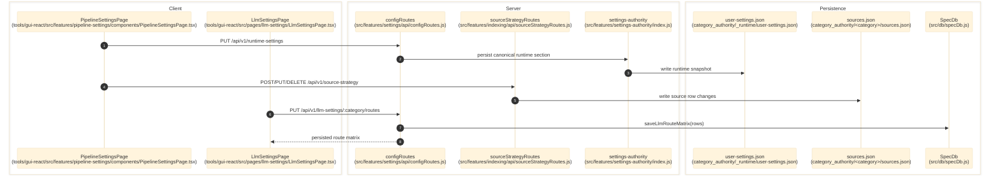

# Pipeline And Runtime Settings

> **Purpose:** Document the verified persistence flow for runtime, UI, storage, source-strategy, and category-scoped LLM route-matrix controls.
> **Prerequisites:** [../02-dependencies/environment-and-config.md](../02-dependencies/environment-and-config.md), [../03-architecture/backend-architecture.md](../03-architecture/backend-architecture.md), [llm-policy-and-provider-config.md](./llm-policy-and-provider-config.md)
> **Last validated:** 2026-03-24

This document covers the pipeline/settings surfaces owned by `PipelineSettingsPage` and `LlmSettingsPage`. The separate `/llm-config` composite policy editor is documented in [llm-policy-and-provider-config.md](./llm-policy-and-provider-config.md).

## Entry Points

| Surface | Path | Role |
|--------|------|------|
| Pipeline settings page | `tools/gui-react/src/features/pipeline-settings/components/PipelineSettingsPage.tsx` | runtime settings, storage settings, and source-strategy editor |
| LLM settings page | `tools/gui-react/src/pages/llm-settings/LlmSettingsPage.tsx` | category-scoped LLM route-matrix editor |
| Settings API | `src/features/settings/api/configRoutes.js` | `/ui-settings`, `/runtime-settings`, `/storage-settings`, `/llm-settings/*`, `/indexing/llm-config` |
| Source strategy API | `src/features/indexing/api/sourceStrategyRoutes.js` | `/source-strategy/*` per-category discovery policy |
| Settings authority | `src/features/settings-authority/index.js` | canonical settings schema, migration, validation, persistence |

## Dependencies

- `src/features/settings-authority/settingsContract.js`
- `src/features/settings-authority/userSettingsService.js`
- `src/features/settings/api/configRuntimeSettingsHandler.js`
- `src/features/settings/api/configStorageSettingsHandler.js`
- `src/features/settings/api/configUiSettingsHandler.js`
- `src/features/settings/api/configLlmSettingsHandler.js`
- `src/features/indexing/api/sourceStrategyRoutes.js`
- `src/features/indexing/sources/sourceFileService.js`
- `src/shared/settingsRegistry.js` - SSOT registry defining 233 live entries across runtime, bootstrap-env, UI, and storage domains; `CONVERGENCE_SETTINGS_REGISTRY` is empty
- `src/shared/settingsDefaults.js` - derived defaults from the registry
- `src/shared/settingsAccessor.js` - null-safe accessor with registry clamping
- `src/api/services/runDataRelocationService.js`
- `src/db/specDb.js`
- `category_authority/_runtime/user-settings.json`

## Flow

1. `tools/gui-react/src/features/pipeline-settings/components/PipelineSettingsPage.tsx` hydrates runtime settings from `GET /api/v1/runtime-settings`; storage and UI-specific saves go to `/api/v1/storage-settings` and `/api/v1/ui-settings`.
2. The same page loads `GET /api/v1/indexing/llm-config` only to derive token defaults and model metadata for runtime-setting helpers; it does not persist through `/llm-policy`.
3. `tools/gui-react/src/features/pipeline-settings/state/sourceStrategyAuthority.ts` calls `/api/v1/source-strategy` for per-category source rows stored in `category_authority/<category>/sources.json`.
4. `tools/gui-react/src/pages/llm-settings/LlmSettingsPage.tsx` reads and writes category route matrices through `GET/PUT /api/v1/llm-settings/:category/routes`.
5. `src/features/settings/api/configRoutes.js` dispatches runtime, storage, and UI writes into their dedicated handlers, which normalize request payloads against contracts exported from `src/features/settings-authority/index.js`.
6. `src/features/settings/api/configPersistenceContext.js` persists canonical sections into `category_authority/_runtime/user-settings.json`, then optionally writes legacy compatibility files when canonical-only writes are disabled.
7. `src/features/settings-authority/userSettingsService.js` projects accepted runtime/storage values back into the live in-memory config object so subsequent runs use the new settings immediately.
8. `src/features/settings/api/configLlmSettingsHandler.js` persists LLM route matrices directly into SQLite through `src/db/specDb.js`.

The `convergence` section still exists in the persisted settings document as `{}` for backward compatibility, but no live `/api/v1/convergence-settings` route is mounted in `src/features/settings/api/configRoutes.js`.

## Side Effects

- Writes canonical settings to `category_authority/_runtime/user-settings.json`.
- Optionally writes legacy compatibility files in `_runtime/` if canonical-only writes are disabled.
- Mutates the live server config object so subsequent runs use updated runtime/storage settings immediately.
- Writes category source-strategy records into `category_authority/<category>/sources.json`.
- Updates `llm_route_matrix` rows in SQLite for category route-matrix changes.
- Emits `data-change` events such as `runtime-settings-updated`, `user-settings-updated`, and route-matrix update broadcasts.

## Error Paths

- Invalid storage payload: `400` with a specific validation message.
- Invalid integer/float/enum runtime setting: key is rejected and reported in the response.
- Missing SpecDb for LLM settings: `500 specdb_unavailable`.
- Source-strategy validation errors are returned from `src/features/indexing/api/sourceStrategyRoutes.js` rather than through settings-authority.
- Persistence failures return route-specific `500 *_persist_failed` errors.

## State Transitions

| Surface | Transition |
|---------|------------|
| UI settings | in-memory toggle -> persisted UI snapshot |
| Runtime settings | request payload -> normalized snapshot -> live config mutation |
| Storage settings | request payload -> normalized storage snapshot -> relocation/archive config mutation |
| Source strategy | form entry -> `sources.json` row -> reloaded authority list |
| LLM route matrix | fetched rows -> edited rows -> persisted SQLite rows |

## Diagram

## Validated Against

| Source | Path | What was verified |
|--------|------|-------------------|
| source | `src/features/settings/api/configRoutes.js` | live settings endpoints and dispatch split |
| source | `src/features/settings/api/configRuntimeSettingsHandler.js` | runtime settings read/write behavior |
| source | `src/features/settings/api/configStorageSettingsHandler.js` | storage settings read/write behavior |
| source | `src/features/settings/api/configUiSettingsHandler.js` | UI settings read/write behavior |
| source | `src/features/settings/api/configLlmSettingsHandler.js` | category route-matrix persistence |
| source | `src/features/settings-authority/README.md` | compatibility-only convergence section invariant |
| source | `src/features/settings-authority/index.js` | exported contracts and helpers |
| source | `src/features/indexing/api/sourceStrategyRoutes.js` | source-strategy read/write surface |
| source | `tools/gui-react/src/features/pipeline-settings/components/PipelineSettingsPage.tsx` | primary GUI settings surface |
| source | `tools/gui-react/src/pages/llm-settings/LlmSettingsPage.tsx` | category LLM route-matrix GUI surface |

## Related Documents

- [LLM Policy and Provider Config](./llm-policy-and-provider-config.md) - Covers the separate composite `/llm-policy` editor.
- [Storage and Run Data](./storage-and-run-data.md) - Storage settings are a subset of this flow but affect run artifact destinations.
- [Category Authority](./category-authority.md) - Persisted settings and source-strategy changes influence authority snapshots and cache invalidation.
