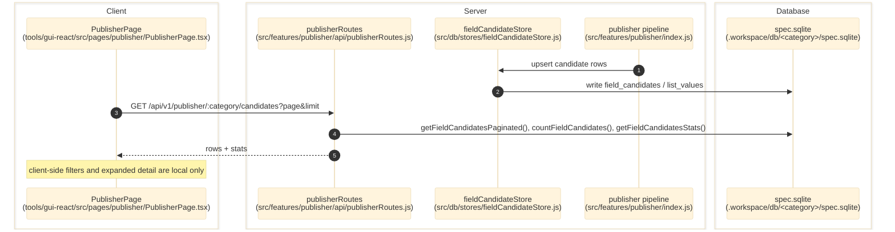

# Publisher

> **Purpose:** Document the verified publisher feature as both a validation pipeline boundary and the read-only `/publisher` audit surface exposed to operators.
> **Prerequisites:** [../03-architecture/data-model.md](../03-architecture/data-model.md), [../03-architecture/routing-and-gui.md](../03-architecture/routing-and-gui.md), [unit-registry.md](./unit-registry.md)
> **Last validated:** 2026-04-18

## Entry Points

| Surface | Path | Role |
|--------|------|------|
| Publisher page | `tools/gui-react/src/pages/publisher/PublisherPage.tsx` | renders `/#/publisher`, polls publisher candidate rows, and exposes expanded validation/source detail |
| Publisher types | `tools/gui-react/src/pages/publisher/types.ts` | TypeScript payload contracts for candidate rows, stats, repairs, and LLM repair decisions |
| Publisher routes | `src/features/publisher/api/publisherRoutes.js` | serves `/publisher/:category/candidates` and `/publisher/:category/stats` |
| Route bootstrap | `src/app/api/guiServerRuntime.js`, `src/features/publisher/api/publisherRouteContext.js` | injects `getSpecDb` and `jsonRes` into the route family |
| Pipeline public API | `src/features/publisher/index.js` | exports validation checks, phase registry, repair adapter, candidate submission, and discovered-enum helpers |
| Candidate SQL projection | `src/db/stores/fieldCandidateStore.js` | hydrates and paginates `field_candidates` rows used by the page |

## Dependencies

- `src/db/specDbSchema.js` - `field_candidates` is the canonical table for publisher candidate rows; `list_values` supports discovered enums.
- `src/db/stores/fieldCandidateStore.js` - parses `sources_json`, `validation_json`, and `metadata_json` for the API payload.
- `src/features/publisher/validation/phaseRegistry.js` - ordered validation phase metadata used by the pipeline.
- `src/features/publisher/validation/checks/checkUnit.js` - unit validation depends on the Unit Registry.
- `src/features/publisher/buildDiscoveredEnumMap.js` and `src/features/publisher/persistDiscoveredValues.js` - discovered-enum read/write helpers.
- `tools/gui-react/src/stores/uiStore.ts` - the page reads the selected category from the shared GUI store.

## Flow

### Operator Audit Flow

1. The operator opens `/#/publisher`, which loads `tools/gui-react/src/pages/publisher/PublisherPage.tsx`.
2. The page reads the active category from `tools/gui-react/src/stores/uiStore.ts`.
3. React Query calls `GET /api/v1/publisher/:category/candidates?page=:page&limit=:limit` through `tools/gui-react/src/api/client.ts`.
4. `src/features/publisher/api/publisherRoutes.js` resolves the category SpecDb and reads:
   - paginated rows via `specDb.getFieldCandidatesPaginated({ limit, offset })`
   - total via `specDb.countFieldCandidates()`
   - aggregate stats via `specDb.getFieldCandidatesStats()`
5. `src/db/stores/fieldCandidateStore.js` hydrates JSON columns into typed structures before the API returns `{ rows, total, page, limit, stats }`.
6. `PublisherPage.tsx` applies client-side filters for date range, status, field, and product text, then renders a table with expandable rows for:
   - repairs
   - rejections
   - LLM repair decisions
   - source history
   - candidate metadata
7. The page refetches every 10 seconds to stay aligned with new pipeline output.

### Upstream Candidate Production

1. The pipeline validates values through publisher checks exposed from `src/features/publisher/index.js`.
2. Successful or repaired values are written into SpecDb through `fieldCandidateStore.upsert(...)`.
3. For enum fields with `open_prefer_known`, `persistDiscoveredValue()` may upsert new `list_values` rows and mark them `needsReview`.
4. Unit-bearing values pass through `checkUnit()`, which resolves against the Unit Registry before persistence.

## Side Effects

- The `/publisher` page itself is read-only.
- Upstream publisher pipeline work populates or updates `field_candidates`.
- Discovered enum values can append to `list_values` when publisher validation accepts a new pipeline value.

## Error Paths

- `GET /api/v1/publisher/:category/candidates` returns `400 { error: 'category required' }` if `:category` is missing.
- The same route returns `404 { error: 'no db for category: ...' }` when SpecDb is unavailable for the category.
- The page disables its query until a category is selected in `uiStore`.
- Any malformed or missing JSON in hydrated rows falls back to empty arrays/objects in `fieldCandidateStore.js` rather than crashing the page.

## State Transitions

| Surface | Trigger | Result |
|---------|---------|--------|
| `field_candidates` row | publisher pipeline writes or updates a candidate | API and GUI audit surface show new value, repair history, and status |
| `list_values` discovered enum rows | `persistDiscoveredValue()` accepts a new enum value | future publisher validation and test-mode audits can see the discovered value |
| GUI table filters | operator changes date/status/field/product filters | table view changes client-side; no backend mutation occurs |
| `publishConfidenceThreshold` setting | user updates it in Publisher → Evaluation settings | `configRuntimeSettingsHandler` auto-fires `reconcileThreshold()` per category (no manual Reconcile button required), flipping `field_candidates.status`, rewriting `product.json.fields[]`, and rebuilding `linked_candidates[]` for every product. Per-category `publisher-reconcile` WS events invalidate downstream GUI queries (review grid cells, drawer candidate lists). |

## Single confidence threshold

`publishConfidenceThreshold` (from `src/shared/settingsRegistry.js`, 0–1 float, default 0.7) is the single source of truth for confidence gating across **every** finder. Per-finder local `minConfidence` gates are forbidden — finders submit every candidate with a real value + evidence, and the publisher decides whether to resolve.

At the data layer, each finder derives the candidate's `confidence` from `max(evidence_refs.confidence)` so the publisher's gate reflects honest per-source strength rather than a hardcoded claim (CEF used to submit `100` unconditionally; RDF used to submit the LLM's overall self-rating). The review drawer also reads this — both the row-header % and the per-source chip are derived from the same `evidence_refs` data, gated by the same threshold.

The publisher writes `linked_candidates[]` into `product.json.fields[fk]` (and `product.json.variant_fields[vid][fk]` for variant-scoped publishes) — the audit set of every value-matching, above-threshold candidate at publish time. The review drawer does **not** consume that JSON; it derives the equivalent set by filtering `candidates` where `status === 'resolved'` so a single SpecDb query powers both views.

## `/publisher/:category/published/:productId` — published-state read

`GET /publisher/:category/published/:productId` returns the per-product `fields` map consumed by the review drawer's `PublishedBadge`, the CEF panel's variant pills, and any other surface that asks "is this value published?". Two SSOT branches:

- **Variant-backed fields (`colors`, `editions`)** read from the `variants` SQL table via `computePublishedArraysFromVariants` (`src/features/color-edition/index.js`). `source` is reported as `'variant_registry'`. Edition combos cascade into colors natively (an edition variant publishes both its slug into `editions` and its color combo into `colors`). After delete-all-runs strips CEF candidates, variants survive — so colors/editions stay published.
- **Everything else** reads `field_candidates.status='resolved'` rows. `metadata.evidence_refs` is parsed for array-typed fields. The `field_candidate_evidence` SQL table is a read projection of those evidence_refs (FK CASCADE wipes it on candidate delete).

The set of variant-backed fields is the constant `VARIANT_BACKED_FIELDS` exported from `src/features/color-edition/index.js`, mirrored on the UI side at `tools/gui-react/src/features/color-edition-finder/index.ts`. Adding a third variant-backed field is a two-file change today; promoting to a `variant_dependent: true` flag on the field rule is the future direction (see review-workbench.md).

## Diagram

## Validated Against

| Source | Path | What was verified |
|--------|------|-------------------|
| source | `src/app/api/guiServerRuntime.js` | live route mounting and publisher route context injection |
| source | `src/features/publisher/api/publisherRoutes.js` | `/publisher/:category/candidates` and `/publisher/:category/stats` contracts |
| source | `src/features/publisher/index.js` | publisher public API boundary |
| source | `src/features/publisher/validation/phaseRegistry.js` | ordered validation phase metadata |
| source | `src/features/publisher/validation/checks/checkUnit.js` | unit-validation dependency on the Unit Registry |
| source | `src/features/publisher/persistDiscoveredValues.js` | discovered-enum write path |
| source | `src/features/publisher/buildDiscoveredEnumMap.js` | discovered-enum read path |
| source | `src/db/specDbSchema.js` | `field_candidates` and `list_values` schema |
| source | `src/db/stores/fieldCandidateStore.js` | hydration and pagination behavior |
| source | `tools/gui-react/src/pages/publisher/types.ts` | GUI payload contract |
| source | `tools/gui-react/src/pages/publisher/PublisherPage.tsx` | polling, filter, table, and expanded-row behavior |
| source | `tools/gui-react/src/stores/uiStore.ts` | selected-category dependency |

## Related Documents

- [Unit Registry](./unit-registry.md) - publisher unit validation resolves against the managed unit registry.
- [Review Workbench](./review-workbench.md) - review flows consume and act on publisher-produced value state.
- [API Surface](../06-references/api-surface.md) - exact `/publisher/:category/*` endpoint contracts.
