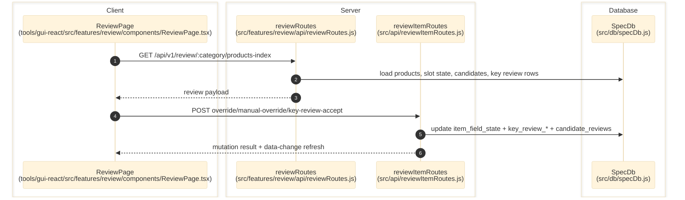

# Review Workbench

> **Purpose:** Document the verified scalar, component, and enum review flows from the GUI to review mutation handlers and SQLite state.
> **Prerequisites:** [../03-architecture/data-model.md](../03-architecture/data-model.md), [catalog-and-product-selection.md](./catalog-and-product-selection.md)
> **Last validated:** 2026-03-23

## Entry Points

| Surface | Path | Role |
|--------|------|------|
| Scalar review page | `tools/gui-react/src/features/review/components/ReviewPage.tsx` | product/field review matrix |
| Component review page | `tools/gui-react/src/pages/component-review/ComponentReviewPage.tsx` | component and enum review surfaces |
| Review API | `src/features/review/api/reviewRoutes.js` | `/review/*` and `/review-components/*` |
| Scalar mutations | `src/api/reviewItemRoutes.js` | override, manual-override, key-review confirm, and key-review accept routes |
| Component mutations | `src/api/reviewComponentMutationRoutes.js` | component property/identity override and component shared-lane confirm |
| Enum mutations | `src/api/reviewEnumMutationRoutes.js` | enum accept/remove/rename actions |

## Dependencies

- `src/features/review-curation/index.js`
- `src/db/specDb.js`
- `src/field-rules/sessionCache.js`
- `src/features/indexing/index.js`
- `tools/gui-react/src/pages/component-review/*.tsx`

## Flow

1. The user opens the review or component-review page.
2. The GUI loads layout and payload endpoints such as `/review/:category/layout`, `/review/:category/products-index`, `/review/:category/candidates/:productId/:fieldKey`, `/review-components/:category/layout`, and `/review-components/:category/components`.
3. `src/features/review/api/reviewRoutes.js` builds the payload from catalog rows, SpecDb slot state, candidate lists, and session-derived field rules.
4. The user accepts a candidate, overrides a value, or runs enum/component review actions.
5. Mutation handlers in `src/api/reviewItemRoutes.js`, `src/api/reviewComponentMutationRoutes.js`, or `src/api/reviewEnumMutationRoutes.js` write to `item_field_state`, `component_values`, `list_values`, `candidate_reviews`, and `key_review_*` tables.
6. Shared-lane helpers synchronize AI/human review state and may cascade changes into queued products or dependent review rows.
7. The route layer emits `data-change` events so open review tabs refresh.

## Side Effects

- Writes accepted field values, component aliases/values, enum rows, candidate review state, and key review state into SQLite.
- May write component override JSON under `category_authority/{category}/_overrides/components/`.
- Running component review batch invokes `src/pipeline/componentReviewBatch.js` and can invalidate caches.

## Error Paths

- Product not in catalog or SpecDb: `404 not_in_catalog` / `503 specdb_not_ready`.
- Review consumer disabled for enum consistency: `403 review_consumer_disabled`.
- Unknown review action or missing ids: `400`.
- Suggestion CLI spawn failure: `500 suggest_failed`.

## State Transitions

| Entity | Transition |
|--------|------------|
| Scalar lane | candidate list -> selected candidate -> confirmed/accepted/overridden state |
| Component row | pending review -> accepted alias/new component/dismissed |
| Enum row | pending review -> mapped to existing / kept new / removed / uncertain |
| Key review state | uninitialized -> confirmed/accepted/overridden |

## Diagram

## Validated Against

| Source | Path | What was verified |
|--------|------|-------------------|
| source | `src/features/review/api/reviewRoutes.js` | Review/read endpoints and mutation handoff |
| source | `src/api/reviewItemRoutes.js` | Scalar review mutations |
| source | `src/api/reviewComponentMutationRoutes.js` | Component review mutations |
| source | `src/api/reviewEnumMutationRoutes.js` | Enum review mutations |
| source | `tools/gui-react/src/features/review/components/ReviewPage.tsx` | Scalar review GUI |
| source | `tools/gui-react/src/pages/component-review/ComponentReviewPage.tsx` | Component review GUI |

## Related Documents

- [Field Rules Studio](./field-rules-studio.md) - Studio definitions shape review layout and review consumer gates.
- [Data Model](../03-architecture/data-model.md) - Review primarily writes slot, review, and key-review tables.
