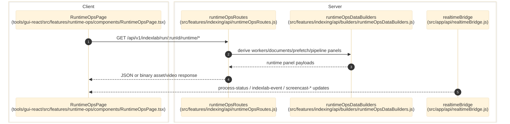

# Runtime Ops

> **Purpose:** Document the verified worker-centric runtime diagnostics flow for completed or active IndexLab runs.
> **Prerequisites:** [indexing-lab.md](./indexing-lab.md), [../03-architecture/routing-and-gui.md](../03-architecture/routing-and-gui.md)
> **Last validated:** 2026-04-04

## Entry Points

| Surface | Path | Role |
|--------|------|------|
| Runtime Ops page | `tools/gui-react/src/features/runtime-ops/components/RuntimeOpsPage.tsx` | selects a run and opens tabs for workers, documents, fallbacks, metrics, and compound analytics |
| Runtime Ops API | `src/features/indexing/api/runtimeOpsRoutes.js` | `/indexlab/run/:runId/runtime/*` |
| Realtime bridge | `src/app/api/realtimeBridge.js` | streams `process-status`, `indexlab-event`, and screencast channels |
| Worker/builders | `src/features/indexing/api/builders/runtimeOpsDataBuilders.js` | derives UI-ready worker/document/fallback state from run events |

## Dependencies

- `src/features/indexing/api/builders/runtimeOpsDataBuilders.js`
- `src/features/indexing/api/builders/indexlabDataBuilders.js`
- `src/features/indexing/api/builders/runtimeOpsPreFetchBuilders.js`
- `src/features/indexing/runtime/idxRuntimeMetadata.js`
- `src/app/api/processRuntime.js`
- run artifacts under the IndexLab root and output root

## Flow

1. The user opens `tools/gui-react/src/features/runtime-ops/components/RuntimeOpsPage.tsx` and selects a run.
2. The page always fetches `/api/v1/indexlab/run/:runId/runtime/summary` and `metrics`; tab panels additionally fetch `workers`, `documents`, `fetch`, `extraction/plugins`, `pipeline`, `prefetch`, and worker-specific screencast/video assets.
3. `src/features/indexing/api/runtimeOpsRoutes.js` resolves the run directory, reads run metadata plus summary events, normalizes stale `running` states for inactive runs, and serves the sub-route requested by the panel.
4. Builder functions in `src/features/indexing/api/builders/runtimeOpsDataBuilders.js` and sibling helper modules derive worker cards, document detail, queue/fallback summaries, prefetch phases, pipeline flow, extraction phases, and metrics from the event stream plus run artifacts.
5. `GET /api/v1/indexlab/run/:runId/runtime/screencast/:workerId/last` returns the last cached frame from `src/app/api/realtimeBridge.js` or synthesizes a proof frame when the worker is terminal and no saved frame exists.
6. `GET /api/v1/indexlab/run/:runId/runtime/video/:workerId` streams the crawl video from the OS-temp video cache when present, and `GET /api/v1/indexlab/run/:runId/runtime/extraction/open-folder/:folder` or `resolve-folder/:folder` bridges the GUI to the local artifact directory.
7. Active runs push `indexlab-event`, `process-status`, and `screencast-*` messages through the realtime bridge; the page invalidates runtime queries on those push events.

## Side Effects

- Runtime Ops is effectively read-only.
- `open-folder` launches the platform file browser for a resolved extraction artifact directory.
- Synthetic proof frames are generated in-memory for response payloads but are not persisted back into canonical storage.

## Error Paths

- Runtime Ops disabled in config: route family is absent.
- Unknown run id: `404 run_not_found`.
- Missing document or screenshot assets: `404 document_not_found`, `404 file_not_found`, or `404 screencast_frame_not_found`.
- Missing or disabled video recording: `404 video_not_found`.
- Invalid asset filename: `400 invalid_filename`.
- Invalid extraction folder token: `400 invalid_folder`.
- `GET /runtime/crawl-ledger` without `product_id` returns `400 { error: 'product_id required' }`.

## Worker State Machine (Fetch Pool)

| State | Badge | Trigger |
|-------|-------|---------|
| `queued` | QUEUED (gray) | `fetch_queued` event |
| `crawling` | CRAWLING (blue, bounce) | `fetch_started` (retry_count=0) |
| `retrying` | Error reason + RETRY Ns (dual badge) | `fetch_started` (retry_count>0) or `fetch_retrying` |
| `stuck` | STUCK (red pulse) | elapsed > handler timeout - 5s |
| `crawled` | CRAWLED (green) | `fetch_finished` success |
| `blocked` | BLOCKED (yellow) | 403/forbidden |
| `rate_limited` | 429 (yellow) | HTTP 429 |
| `captcha` | CAPTCHA (red) | captcha/cloudflare |
| `failed` | Specific error: TIMEOUT/5XX/DNS/DOWNLOAD (red) | all retries exhausted |

Non-fetch pools (search, llm, parse) keep `running`/`idle` states.

Worker rows show: truncated URL path, proxy label (`direct` or proxy hostname), elapsed timer on all pools.

## Dual Badge System

When a worker is retrying, two badges stack vertically:
- **Primary** (top): The real error reason (403, CAPTCHA, TIMEOUT, etc.) with severity color
- **Secondary** (bottom): `RETRY Ns` with live count-up timer, blue pulse animation

Terminal states show a single badge with the specific error (not generic "FAILED").

## State Transitions

| State | Trigger | Result |
|-------|---------|--------|
| live worker snapshot | active run + websocket updates | tabs continue updating |
| inactive run replay | process ended | route normalizes stale `running` metadata to `completed` or `failed` |
| missing screenshot | no retained browser frame | synthetic SVG proof frame returned (excludes `crawling`/`retrying` active states) |
| local artifact access | GUI opens or resolves extraction folder | route returns or opens a validated local artifact directory under the run tree |

## Diagram

## Validated Against

| Source | Path | What was verified |
|--------|------|-------------------|
| source | `src/features/indexing/api/runtimeOpsRoutes.js` | Runtime Ops endpoints and asset logic |
| source | `src/features/indexing/api/builders/runtimeOpsDataBuilders.js` | worker/document/fallback derivations |
| source | `src/features/indexing/api/builders/runtimeOpsExtractionPluginBuilders.js` | extraction plugin phase derivations |
| source | `src/features/indexing/api/runtimeOpsVideoHelpers.js` | runtime video lookup and stream path |
| source | `src/app/api/realtimeBridge.js` | websocket channels and subscriptions |
| source | `src/app/api/processRuntime.js` | IPC broadcast of runtime updates and screencast frames |
| source | `tools/gui-react/src/features/runtime-ops/components/RuntimeOpsPage.tsx` | GUI entrypoint |

## Related Documents

- [Indexing Lab](./indexing-lab.md) - Runtime Ops consumes run artifacts produced by indexing runs.
- [API Surface](../06-references/api-surface.md) - Enumerates the complete `/runtime/*` endpoint set.
