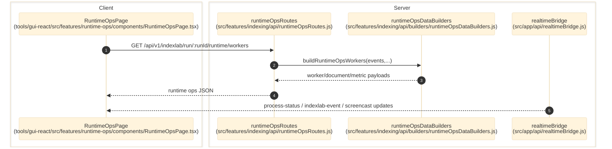

# Runtime Ops

> **Purpose:** Document the verified worker-centric runtime diagnostics flow for completed or active IndexLab runs.
> **Prerequisites:** [indexing-lab.md](./indexing-lab.md), [../03-architecture/routing-and-gui.md](../03-architecture/routing-and-gui.md)
> **Last validated:** 2026-03-24

## Entry Points

| Surface | Path | Role |
|--------|------|------|
| Runtime Ops page | `tools/gui-react/src/features/runtime-ops/components/RuntimeOpsPage.tsx` | selects a run and opens tabs for workers, documents, fallbacks, metrics, and compound analytics |
| Runtime Ops API | `src/features/indexing/api/runtimeOpsRoutes.js` | `/indexlab/run/:runId/runtime/*` |
| Realtime bridge | `src/app/api/realtimeBridge.js` | streams `process-status`, `indexlab-event`, and screencast channels |
| Worker/builders | `src/features/indexing/api/builders/runtimeOpsDataBuilders.js` | derives UI-ready worker/document/fallback state from run events |

## Dependencies

- `src/features/indexing/api/builders/runtimeOpsDataBuilders.js`
- `src/features/indexing/api/builders/indexlabDataBuilders.js`
- `src/features/indexing/api/builders/runtimeOpsPreFetchBuilders.js`
- `src/features/indexing/runtime/idxRuntimeMetadata.js`
- `src/app/api/processRuntime.js`
- run artifacts under the IndexLab root and output root

## Flow

1. The user opens `tools/gui-react/src/features/runtime-ops/components/RuntimeOpsPage.tsx` and selects a run.
2. The page fetches `/api/v1/indexlab/run/:runId/runtime/summary`, `workers`, `documents`, `metrics`, `queue`, `pipeline`, `fallbacks`, and `prefetch`.
3. `src/features/indexing/api/runtimeOpsRoutes.js` reads `run.json`, `run_events.ndjson`, search/profile artifacts, and screenshot manifests.
4. Builder functions derive worker cards, document detail, extraction field summaries, and LLM dashboards from the event stream.
5. When the GUI requests `/screencast/:workerId/last`, the route serves the last retained frame or synthesizes a proof frame if the worker finished without a stored screenshot.
6. Active runs continue streaming websocket updates from `src/app/api/realtimeBridge.js`.

## Side Effects

- Runtime Ops is effectively read-only.
- Synthetic proof frames are generated in-memory for response payloads but are not persisted back into canonical storage.

## Error Paths

- Runtime Ops disabled in config: route family is absent.
- Unknown run id: `404 run_not_found`.
- Missing document or screenshot assets: `404 document_not_found`, `404 file_not_found`, or `404 screencast_frame_not_found`.
- Invalid asset filename: `400 invalid_filename`.

## State Transitions

| State | Trigger | Result |
|-------|---------|--------|
| live worker snapshot | active run + websocket updates | tabs continue updating |
| inactive run replay | process ended | route normalizes stale `running` metadata to `completed` or `failed` |
| missing screenshot | no retained browser frame | synthetic SVG proof frame returned |

## Diagram

## Validated Against

| Source | Path | What was verified |
|--------|------|-------------------|
| source | `src/features/indexing/api/runtimeOpsRoutes.js` | Runtime Ops endpoints and asset logic |
| source | `src/features/indexing/api/builders/runtimeOpsDataBuilders.js` | worker/document/fallback derivations |
| source | `src/app/api/realtimeBridge.js` | websocket channels and subscriptions |
| source | `tools/gui-react/src/features/runtime-ops/components/RuntimeOpsPage.tsx` | GUI entrypoint |

## Related Documents

- [Indexing Lab](./indexing-lab.md) - Runtime Ops consumes run artifacts produced by indexing runs.
- [API Surface](../06-references/api-surface.md) - Enumerates the complete `/runtime/*` endpoint set.
