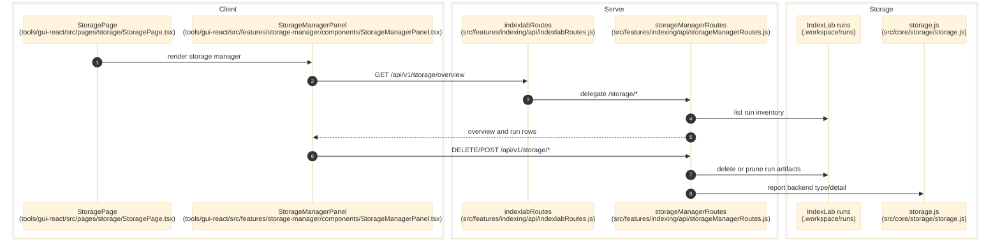

# Storage And Run Data

> **Purpose:** Document the verified storage-manager inventory and maintenance surface plus the current storage-backend selection behavior.
> **Prerequisites:** [../02-dependencies/environment-and-config.md](../02-dependencies/environment-and-config.md), [../03-architecture/backend-architecture.md](../03-architecture/backend-architecture.md)
> **Last validated:** 2026-04-07

The current live storage feature is the `/storage` inventory and maintenance surface. The older storage-settings and relocation flow is not mounted in the current source tree.

## Entry Points

| Surface | Path | Role |
|--------|------|------|
| storage page | `tools/gui-react/src/pages/storage/StoragePage.tsx` | thin page wrapper for the storage manager |
| storage manager panel | `tools/gui-react/src/features/storage-manager/components/StorageManagerPanel.tsx` | run overview, run inventory, and destructive maintenance actions |
| storage manager API | `src/features/indexing/api/storageManagerRoutes.js` | `/storage/*` inventory, delete, prune, purge, and export endpoints |
| IndexLab route delegation | `src/features/indexing/api/indexlabRoutes.js` | mounts the storage manager under the main indexing route family |
| storage backend adapter | `src/core/storage/storage.js` | local filesystem storage adapter |
| storage overview bar | `tools/gui-react/src/features/storage-manager/components/StorageOverviewBar.tsx` | renders aggregate inventory and backend details |

## Dependencies

- `src/features/indexing/api/storageManagerRoutes.js`
- `src/features/indexing/api/indexlabRoutes.js`
- `src/core/storage/storage.js`
- `tools/gui-react/src/features/storage-manager/state/useStorageOverview.ts`
- `tools/gui-react/src/features/storage-manager/state/useStorageRuns.ts`
- `tools/gui-react/src/features/storage-manager/state/useStorageActions.ts`
- `tools/gui-react/src/features/storage-manager/components/StorageOverviewBar.tsx`
- `tools/gui-react/src/features/storage-manager/components/StorageOperationsBar.tsx`
- `tools/gui-react/src/features/storage-manager/components/tables/ProductTable.tsx`

## Flow

1. The operator opens `/storage`, which renders `tools/gui-react/src/pages/storage/StoragePage.tsx`.
2. `StoragePage` renders only `StorageManagerPanel`; no storage-settings form is mounted.
3. `useStorageOverview()` calls `GET /api/v1/storage/overview`.
4. `useStorageRuns()` calls `GET /api/v1/storage/runs` and optionally filters by category.
5. `useStorageActions.ts` calls:
   - `POST /api/v1/storage/runs/bulk-delete`
   - `DELETE /api/v1/storage/runs/:runId`
   - `POST /api/v1/storage/urls/delete`
   - `POST /api/v1/storage/products/:productId/purge-history`
   - `POST /api/v1/storage/prune`
   - `POST /api/v1/storage/purge`
   - `GET /api/v1/storage/export`
6. `src/features/indexing/api/storageManagerRoutes.js` lists run artifacts from the IndexLab storage tree and executes delete, URL-history cleanup, product-history purge, prune, purge, and export operations.
7. The same handler currently reports `storage_backend: "local"` and `backend_detail.root_path = indexLabRoot` from its own `resolveBackend()` helpers.
8. `src/core/storage/storage.js` provides local filesystem storage; the S3 backend has been retired.

## Side Effects

- Deletes archived run bundles one at a time.
- Bulk-deletes archived runs.
- Deletes one URL and its derived artifacts through the SpecDb-backed deletion store when available.
- Purges all run history for one product through the same deletion-store boundary.
- Prunes old runs or failed runs.
- Purges all archived runs after explicit confirmation.
- Exports the current inventory as `storage-inventory.json`.
- Invalidates React Query storage caches after successful mutations.

## Error Paths

- `GET /storage/runs/:runId` returns `404 run_not_found` when metadata cannot be resolved.
- `DELETE /storage/runs/:runId` returns `409 run_in_progress` when the run is still active.
- `POST /storage/purge` returns `400 confirm_token_required` unless the request body contains `confirmToken: "DELETE"`.
- `POST /storage/urls/delete` returns `501 deletion_store_not_available` when SpecDb-backed deletion cannot be resolved, or `400 url_and_productId_required` when required parameters are missing.
- `POST /storage/products/:productId/purge-history` returns `400 productId_and_category_required`, `501 deletion_store_not_available`, or `409 product_has_active_run` when history cannot be safely purged.
- `StorageManagerPanel` shows a warning banner when overview or run-list queries fail.

## State Transitions

| Surface | Transition |
|---------|------------|
| storage overview | run artifacts on disk -> summarized overview payload |
| run inventory | archived run tree -> filtered table rows |
| delete/prune/purge | selected or matched runs -> removed run artifacts -> invalidated queries |
| URL delete | selected URL + product context -> SpecDb/file-system cascade delete -> invalidated storage queries |
| product history purge | selected product + category -> all run history removed/reset -> invalidated storage queries |
| backend label | route-local backend resolution -> `storage_backend` and `backend_detail` in `/storage/overview` |

## Diagram

## Validated Against

| Source | Path | What was verified |
|--------|------|-------------------|
| source | `tools/gui-react/src/pages/storage/StoragePage.tsx` | page now renders only `StorageManagerPanel` |
| source | `tools/gui-react/src/features/storage-manager/components/StorageManagerPanel.tsx` | live GUI storage surface |
| source | `tools/gui-react/src/features/storage-manager/components/StorageOverviewBar.tsx` | backend/inventory summary presentation |
| source | `tools/gui-react/src/features/storage-manager/state/useStorageActions.ts` | client mutations limited to delete/prune/purge |
| source | `tools/gui-react/src/features/storage-manager/state/useStorageOverview.ts` | `/storage/overview` client contract |
| source | `tools/gui-react/src/features/storage-manager/state/useStorageRuns.ts` | `/storage/runs` client contract |
| source | `src/features/indexing/api/indexlabRoutes.js` | `/storage/*` delegation path |
| source | `src/features/indexing/api/storageManagerRoutes.js` | actual inventory and maintenance endpoints |
| source | `src/db/stores/deletionStore.js` | URL-delete and product-history purge result shapes |
| source | `src/core/storage/storage.js` | local filesystem storage adapter |
| runtime | `GET /api/v1/storage/overview` | live backend reported `storage_backend: "local"` on 2026-04-07 |

## Related Documents

- [Backend Architecture](../03-architecture/backend-architecture.md) - How the storage manager is mounted in the server.
- [API Surface](../06-references/api-surface.md) - Exact `/storage/*` contracts.
- [Known Issues](../05-operations/known-issues.md) - Tracks current storage-surface and test drift.
