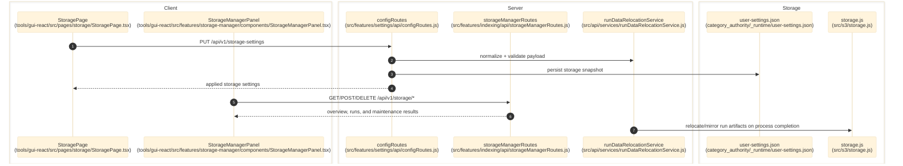

# Storage And Run Data

> **Purpose:** Document the verified run-data storage settings, storage-manager inventory/maintenance surface, and post-run relocation/archive behavior.
> **Prerequisites:** [../02-dependencies/environment-and-config.md](../02-dependencies/environment-and-config.md), [pipeline-and-runtime-settings.md](./pipeline-and-runtime-settings.md)
> **Last validated:** 2026-03-25

## Entry Points

| Surface | Path | Role |
|--------|------|------|
| Storage page | `tools/gui-react/src/pages/storage/StoragePage.tsx` | update storage settings, browse local destinations, and host the storage-manager panel |
| Storage manager panel | `tools/gui-react/src/features/storage-manager/components/StorageManagerPanel.tsx` | run inventory, overview, delete/prune/purge/export, and sync controls |
| Storage settings API | `src/features/settings/api/configRoutes.js` | `/storage-settings` and `/storage-settings/local/browse` |
| Storage manager API | `src/features/indexing/api/storageManagerRoutes.js` | `/storage/*` inventory, maintenance, export, and sync endpoints |
| Relocation service | `src/api/services/runDataRelocationService.js` | validates destinations and relocates/archives run outputs |
| Storage backend adapter | `src/s3/storage.js` | local, S3, and dual mirrored storage implementations |
| Completion hooks | `src/api/services/indexLabProcessCompletion.js`, `src/api/services/compileProcessCompletion.js` | invoke relocation after process exit |

## Dependencies

- `category_authority/_runtime/user-settings.json`
- `src/core/config/runtimeArtifactRoots.js`
- `src/app/api/processRuntime.js`
- `src/features/indexing/api/indexlabRoutes.js`
- `src/features/indexing/api/storageManagerRoutes.js`
- `src/api/services/storageMetricsService.js`
- `src/api/services/storageSyncService.js`
- `src/features/indexing/api/builders/archivedRunLocationHelpers.js`
- `tools/gui-react/src/features/storage-manager/state/useStorageOverview.ts`
- `tools/gui-react/src/features/storage-manager/state/useStorageRuns.ts`
- `tools/gui-react/src/features/storage-manager/state/useStorageActions.ts`
- `tools/gui-react/src/features/storage-manager/components/StorageOperationsBar.tsx`
- `tools/gui-react/src/features/storage-manager/types.ts`
- output root and IndexLab root directories
- optional AWS S3 credentials consumed by `src/s3/storage.js`

## Flow

1. The user opens `tools/gui-react/src/pages/storage/StoragePage.tsx`, which drives both the storage-settings form and the embedded `StorageManagerPanel`.
2. The page loads `/api/v1/storage-settings` and may browse candidate local folders via `/api/v1/storage-settings/local/browse`.
3. `src/features/settings/api/configRoutes.js` normalizes and validates the submitted storage payload with helpers from `src/api/services/runDataRelocationService.js`.
4. Persisted storage settings are written into `user-settings.json` and applied to the live `runDataStorageState` object.
5. `tools/gui-react/src/features/storage-manager/state/useStorageOverview.ts` and `useStorageRuns.ts` call `GET /api/v1/storage/overview` and `GET /api/v1/storage/runs`, which reach `src/features/indexing/api/storageManagerRoutes.js` through the `/storage/*` delegation in `src/features/indexing/api/indexlabRoutes.js`.
6. `tools/gui-react/src/features/storage-manager/state/useStorageActions.ts` invokes delete, prune, purge, export, recalculate, and sync endpoints under `/api/v1/storage/*`; those operations mutate archived run bundles and then invalidate the React Query storage caches.
7. When a compile or indexing process exits, completion services evaluate the configured destination and relocate or archive run artifacts accordingly.
8. `src/s3/storage.js` reads/writes artifacts in local, S3, or dual-mirror mode depending on `outputMode` and storage settings.

## Side Effects

- Creates local directories when a new local destination is selected.
- May copy/move archive data into a configured local folder or S3 bucket/prefix after run completion.
- In `dual` mode, local writes remain canonical and S3 writes are best-effort mirrors.
- Deletes single runs or batches of archived runs from local storage.
- Prunes old or failed run bundles and can purge all archived runs after explicit confirmation.
- Exports the run inventory as `storage-inventory.json`.
- Recalculates run-size metrics across the archived run tree.
- Pushes/pulls archived runs through the optional storage sync service when configured.

## Error Paths

- Invalid storage payload: `400` with validation message.
- Invalid browse path or inaccessible directory: `400`.
- `DELETE /storage/runs/:runId` returns `409 run_in_progress` when the selected run is still active.
- `POST /storage/purge` returns `400 confirm_token_required` unless the request body includes `confirmToken: "DELETE"`.
- `/storage/sync/*` returns `501 sync_service_not_configured` when the sync service is unavailable.
- `GET /storage/runs/:runId` returns `404 run_not_found` when the requested run metadata cannot be resolved.
- Mirror write/delete failures in `DualMirroredStorage` log to stderr but do not block the local write path.

## State Transitions

| Setting | Transition |
|---------|------------|
| destination type | local <-> s3 |
| local directory | default path -> operator-selected path |
| run data | active output root -> archived/relocated snapshot after completion |
| storage inventory | archived run tree -> overview/runs query snapshot -> optional delete/prune/purge/export/sync action |

## Diagram

## Validated Against

| Source | Path | What was verified |
|--------|------|-------------------|
| source | `src/features/settings/api/configRoutes.js` | browse and storage settings endpoints |
| source | `src/features/indexing/api/indexlabRoutes.js` | `/storage/*` delegation from the IndexLab route family |
| source | `src/features/indexing/api/storageManagerRoutes.js` | inventory, delete/prune/purge/export, and sync endpoints |
| source | `src/api/services/runDataRelocationService.js` | normalization, validation, and relocation behavior |
| source | `src/api/services/storageMetricsService.js` | recalculation behavior for storage metrics |
| source | `src/api/services/storageSyncService.js` | optional sync-service contract used by `/storage/sync/*` |
| source | `src/s3/storage.js` | local/S3/dual storage backends |
| source | `tools/gui-react/src/pages/storage/StoragePage.tsx` | GUI storage surface |
| source | `tools/gui-react/src/features/storage-manager/components/StorageManagerPanel.tsx` | embedded storage-manager UI surface |
| source | `tools/gui-react/src/features/storage-manager/state/useStorageActions.ts` | GUI wiring for `/storage/*` maintenance actions |

## Related Documents

- [Pipeline and Runtime Settings](./pipeline-and-runtime-settings.md) - Storage is persisted through the same settings-authority workflow.
- [Deployment](../05-operations/deployment.md) - Describes the supported local runtime and packaging paths that consume these storage settings.
