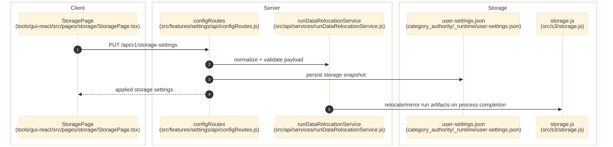

# Storage And Run Data

> **Purpose:** Document the verified run-data storage settings, browse flow, and post-run relocation/archive behavior.
> **Prerequisites:** [../02-dependencies/environment-and-config.md](../02-dependencies/environment-and-config.md), [pipeline-and-runtime-settings.md](./pipeline-and-runtime-settings.md)
> **Last validated:** 2026-03-15

## Entry Points

| Surface | Path | Role |
|--------|------|------|
| Storage page | `tools/gui-react/src/pages/storage/StoragePage.tsx` | browse local destinations and update storage settings |
| Storage settings API | `src/features/settings/api/configRoutes.js` | `/storage-settings` and `/storage-settings/local/browse` |
| Relocation service | `src/api/services/runDataRelocationService.js` | validates destinations and relocates/archives run outputs |
| Storage backend adapter | `src/s3/storage.js` | local, S3, and dual mirrored storage implementations |
| Completion hooks | `src/api/services/indexLabProcessCompletion.js`, `src/api/services/compileProcessCompletion.js` | invoke relocation after process exit |

## Dependencies

- `category_authority/_runtime/user-settings.json`
- `src/core/config/runtimeArtifactRoots.js`
- `src/app/api/processRuntime.js`
- output root and IndexLab root directories
- optional AWS S3 credentials consumed by `src/s3/storage.js`

## Flow

1. The user opens `tools/gui-react/src/pages/storage/StoragePage.tsx`.
2. The page loads `/api/v1/storage-settings` and may browse candidate local folders via `/api/v1/storage-settings/local/browse`.
3. `src/features/settings/api/configRoutes.js` normalizes and validates the submitted storage payload with helpers from `src/api/services/runDataRelocationService.js`.
4. Persisted storage settings are written into `user-settings.json` and applied to the live `runDataStorageState` object.
5. When a compile or indexing process exits, completion services evaluate the configured destination and relocate or archive run artifacts accordingly.
6. `src/s3/storage.js` reads/writes artifacts in local, S3, or dual-mirror mode depending on `outputMode` and storage settings.

## Side Effects

- Creates local directories when a new local destination is selected.
- May copy/move archive data into a configured local folder or S3 bucket/prefix after run completion.
- In `dual` mode, local writes remain canonical and S3 writes are best-effort mirrors.

## Error Paths

- Invalid storage payload: `400` with validation message.
- Invalid browse path or inaccessible directory: `400`.
- Mirror write/delete failures in `DualMirroredStorage` log to stderr but do not block the local write path.

## State Transitions

| Setting | Transition |
|---------|------------|
| destination type | local <-> s3 |
| local directory | default path -> operator-selected path |
| run data | active output root -> archived/relocated snapshot after completion |

## Diagram

## Validated Against

| Source | Path | What was verified |
|--------|------|-------------------|
| source | `src/features/settings/api/configRoutes.js` | browse and storage settings endpoints |
| source | `src/api/services/runDataRelocationService.js` | normalization, validation, and relocation behavior |
| source | `src/s3/storage.js` | local/S3/dual storage backends |
| source | `tools/gui-react/src/pages/storage/StoragePage.tsx` | GUI storage surface |

## Related Documents

- [Pipeline and Runtime Settings](./pipeline-and-runtime-settings.md) - Storage is persisted through the same settings-authority workflow.
- [Deployment](../05-operations/deployment.md) - Describes the supported local runtime and packaging paths that consume these storage settings.