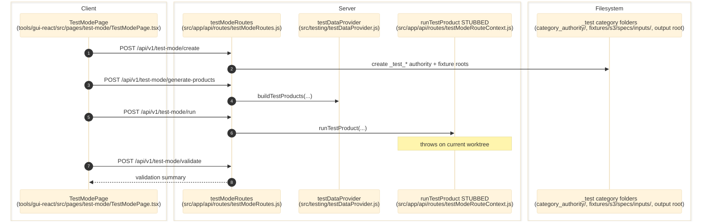

# Test Mode

> **Purpose:** Document the verified synthetic test-category workflow used to create `_test_*` categories, generate products, attempt runs, and validate outcomes.
> **Prerequisites:** [field-rules-studio.md](./field-rules-studio.md), [../03-architecture/data-model.md](../03-architecture/data-model.md)
> **Last validated:** 2026-03-24

## Entry Points

| Surface | Path | Role |
|--------|------|------|
| Test mode page | `tools/gui-react/src/pages/test-mode/TestModePage.tsx` | create, generate, run, validate, and delete test categories |
| Test mode API | `src/app/api/routes/testModeRoutes.js` | `/test-mode/*` endpoints |
| Test data provider | `src/testing/testDataProvider.js` | builds synthetic products, component DB seeds, and validation checks |
| Test run stub | `src/app/api/routes/testModeRouteContext.js` | **STUBBED** - `runTestProduct()` throws until the test runner is rebuilt for the crawl-first pipeline |

## Dependencies

- `category_authority/{category}/_generated/*`
- `category_authority/_test_{sourceCategory}/`
- `fixtures/s3/specs/inputs/_test_{sourceCategory}/products/*.json`
- output-root `specs/outputs/_test_{sourceCategory}`
- `src/api/services/specDbSyncService.js`

## Flow

1. The user clicks create in `tools/gui-react/src/pages/test-mode/TestModePage.tsx`.
2. `POST /api/v1/test-mode/create` copies generated rule assets from the source category into a new `_test_{category}` authority folder, seeds component DB fixtures, and resets any previous test-state artifacts.
3. `POST /api/v1/test-mode/generate-products` creates synthetic input JSON products and a generated product catalog for the test category.
4. `POST /api/v1/test-mode/run` is currently non-functional: `src/app/api/routes/testModeRouteContext.js` injects a stub `runTestProduct()` that throws `test mode pipeline removed - use crawl pipeline`, so the endpoint returns `200 { ok: true, results }` with per-product `status: 'error'` rows.
5. Optional AI review still attempts `runComponentReviewBatch()`, and SpecDb sync is re-run so review surfaces reflect the latest test data when earlier steps succeeded.
6. `POST /api/v1/test-mode/validate` evaluates expectations using `buildValidationChecks()`.
7. `DELETE /api/v1/test-mode/:category` removes the generated authority, fixture, and output directories and prunes temporary brand registry entries.

## Side Effects

- Creates and deletes `_test_*` directories under category authority, fixtures, and output roots.
- Resets or purges test-mode SpecDb state.
- Generates synthetic brands and may temporarily add them to the brand registry.
- Emits `test-mode-*` and `review` data-change events.

## Error Paths

- Invalid or non-test category: `400 invalid_test_category`.
- Missing source category generated rules: `400 source_category_not_found`.
- The run step records thrown runner errors inside `results[]` rows instead of failing the whole HTTP response.
- SpecDb resync failure after run is returned as a warning row in the results payload rather than crashing the whole response.

## State Transitions

| Entity | Transition |
|--------|------------|
| Test category | absent -> created -> populated -> deleted |
| Test product | generated fixture -> attempted run result (`complete` or `error`) -> validated result |
| Test review state | reset -> repopulated from test artifacts + optional AI review |

## Diagram

## Validated Against

| Source | Path | What was verified |
|--------|------|-------------------|
| source | `src/app/api/routes/testModeRoutes.js` | full test-mode lifecycle endpoints |
| source | `src/app/api/routes/testModeRouteContext.js` | stubbed test-mode run contract |
| source | `src/testing/testDataProvider.js` | synthetic product/data generation |
| source | `tools/gui-react/src/pages/test-mode/TestModePage.tsx` | GUI entrypoint |

## Related Documents

- [Field Rules Studio](./field-rules-studio.md) - Test mode copies generated category artifacts produced by compile flows.
- [Review Workbench](./review-workbench.md) - Test runs can populate review surfaces and optional AI review queues.
