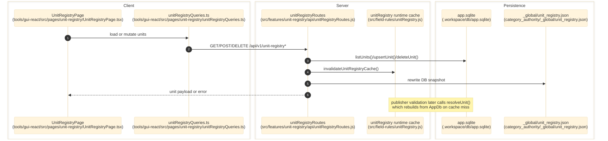

# Unit Registry

> **Purpose:** Document the verified global unit registry flow from the `/units` GUI surface through AppDb persistence, JSON mirroring, and downstream publisher unit validation.
> **Prerequisites:** [../03-architecture/data-model.md](../03-architecture/data-model.md), [../03-architecture/routing-and-gui.md](../03-architecture/routing-and-gui.md), [publisher.md](./publisher.md)
> **Last validated:** 2026-04-10

## Entry Points

| Surface | Path | Role |
|--------|------|------|
| Unit registry page | `tools/gui-react/src/pages/unit-registry/UnitRegistryPage.tsx` | renders `/#/units`, groups units by family, and runs CRUD mutations |
| Query hooks | `tools/gui-react/src/pages/unit-registry/unitRegistryQueries.ts` | reads and mutates `/api/v1/unit-registry*` |
| Route registrar | `src/features/unit-registry/api/unitRegistryRoutes.js` | serves list, detail, upsert, delete, and sync endpoints |
| Route bootstrap | `src/app/api/guiServerRuntime.js` | injects `appDb` and `_global/unit_registry.json` path into the route context |
| AppDb table | `src/db/appDbSchema.js`, `src/db/appDb.js` | canonical mutable store for units, synonyms, and conversions |
| Runtime consumer | `src/field-rules/unitRegistry.js` | lazy runtime cache used by publisher unit validation |

## Dependencies

- `src/db/appDbSchema.js` - AppDb `unit_registry` table is the canonical mutable store.
- `src/db/appDb.js` - `listUnits()`, `getUnit()`, `upsertUnit()`, and `deleteUnit()` are the live CRUD operations.
- `category_authority/_global/unit_registry.json` - durable JSON mirror written after mutations.
- `src/field-rules/unitRegistry.js` - caches AppDb rows into canonical/synonym/conversion maps.
- `src/features/publisher/validation/checks/checkUnit.js` - downstream publisher validation depends on the registry.

## Flow

1. The operator opens `/#/units`, which loads `tools/gui-react/src/pages/unit-registry/UnitRegistryPage.tsx`.
2. `useUnitRegistryQuery()` in `tools/gui-react/src/pages/unit-registry/unitRegistryQueries.ts` calls `GET /api/v1/unit-registry` through `tools/gui-react/src/api/client.ts`.
3. `src/features/unit-registry/api/unitRegistryRoutes.js` reads all rows from AppDb with `appDb.listUnits()` and returns `{ units }`.
4. When the operator adds or edits a unit, `useUpsertUnitMutation()` posts to `POST /api/v1/unit-registry`.
5. The route validates `canonical`, normalizes `label`, `synonyms`, and `conversions`, then upserts the row with `appDb.upsertUnit(...)`.
6. After a successful write, the route calls `invalidateUnitRegistryCache()` in `src/field-rules/unitRegistry.js` and rewrites `category_authority/_global/unit_registry.json` from the current AppDb snapshot.
7. When the operator deletes a unit, `useDeleteUnitMutation()` calls `DELETE /api/v1/unit-registry/:canonical`, which deletes the AppDb row, invalidates the runtime cache, and rewrites the JSON mirror.
8. Downstream, publisher validation calls `resolveUnit()` from `src/field-rules/unitRegistry.js`, which lazily rebuilds the cache from AppDb and resolves exact matches, synonyms, and conversions.

## Side Effects

- AppDb `unit_registry` rows are inserted, updated, or deleted.
- `category_authority/_global/unit_registry.json` is regenerated after successful writes.
- The in-process unit registry cache is invalidated, forcing the next publisher validation call to rebuild from AppDb.

## Error Paths

- `POST /api/v1/unit-registry` returns `400 { error: 'canonical is required' }` when `canonical` is missing or blank.
- `GET /api/v1/unit-registry/:canonical` returns `404 { error: 'Unit not found' }` for an unknown canonical.
- `DELETE /api/v1/unit-registry/:canonical` returns `404 { error: 'Unit not found' }` when the row does not exist.
- No auth middleware protects these routes; treat them as trusted-network/local-operator surfaces.

## State Transitions

| Surface | Trigger | Result |
|---------|---------|--------|
| AppDb `unit_registry` | `POST /api/v1/unit-registry` | row is inserted or updated |
| JSON mirror | successful POST or DELETE, or `POST /api/v1/unit-registry/sync` | `_global/unit_registry.json` is regenerated from AppDb |
| Runtime cache | successful POST or DELETE | next `resolveUnit()` call rebuilds maps from AppDb |

## Diagram

## Validated Against

| Source | Path | What was verified |
|--------|------|-------------------|
| source | `src/app/api/guiServerRuntime.js` | live route mounting and `_global/unit_registry.json` path injection |
| source | `src/features/unit-registry/api/unitRegistryRoutes.js` | list/detail/upsert/delete/sync endpoint behavior |
| source | `src/db/appDbSchema.js` | `unit_registry` table contract |
| source | `src/db/appDb.js` | AppDb CRUD methods for units |
| source | `src/field-rules/unitRegistry.js` | runtime cache, synonym resolution, and conversion map behavior |
| source | `src/features/publisher/validation/checks/checkUnit.js` | downstream validation dependency on the registry |
| source | `tools/gui-react/src/pages/unit-registry/unitRegistryQueries.ts` | GUI query and mutation surface |
| source | `tools/gui-react/src/pages/unit-registry/UnitRegistryPage.tsx` | grouped UI, search, add/edit/delete flows |

## Related Documents

- [Publisher](./publisher.md) - publisher unit validation consumes this registry at runtime.
- [Data Model](../03-architecture/data-model.md) - schema detail for AppDb `unit_registry`.
- [API Surface](../06-references/api-surface.md) - exact `/unit-registry*` endpoint contracts.
