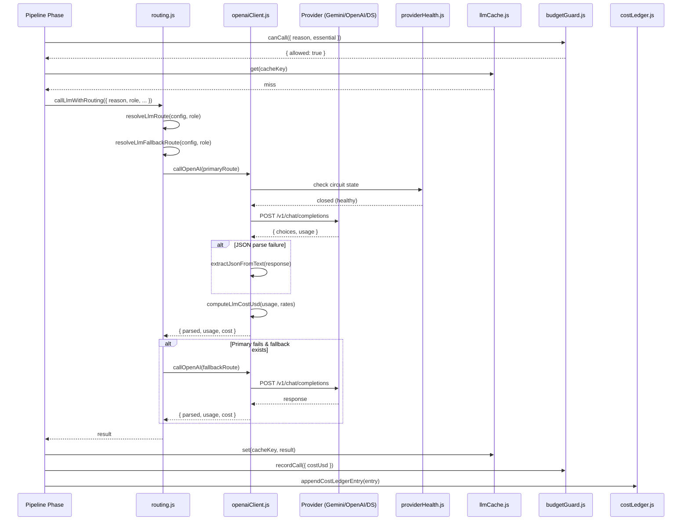
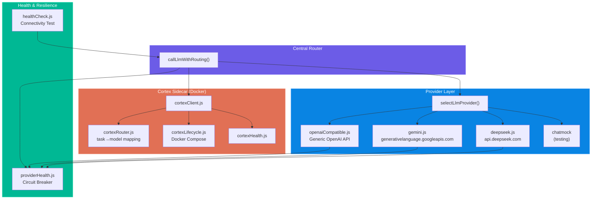
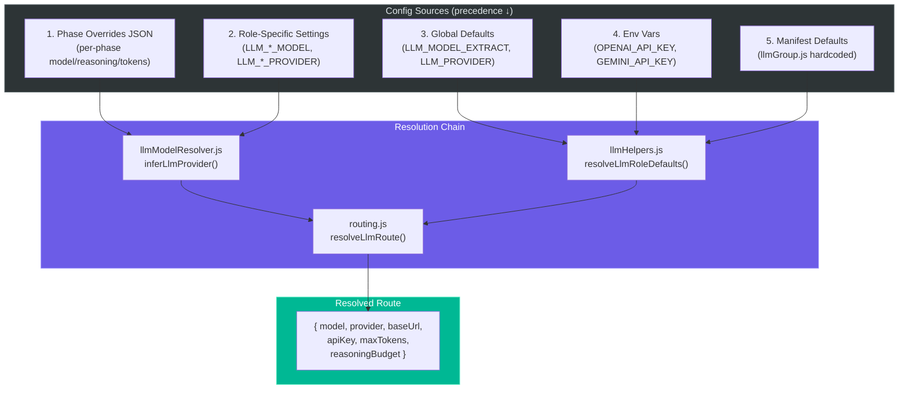
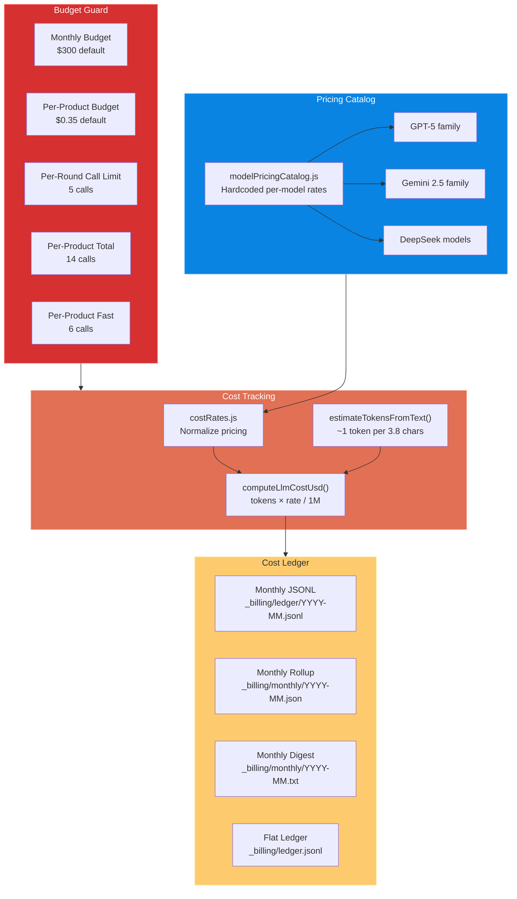
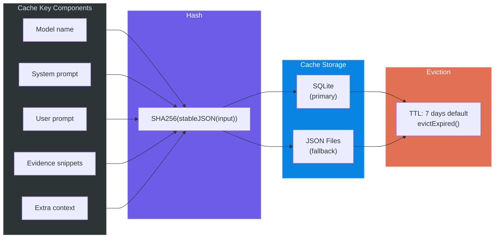
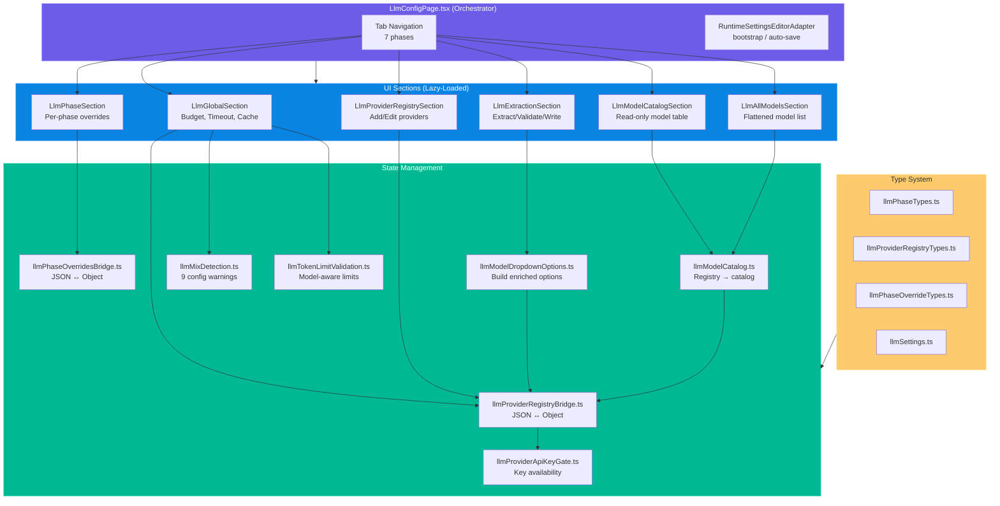
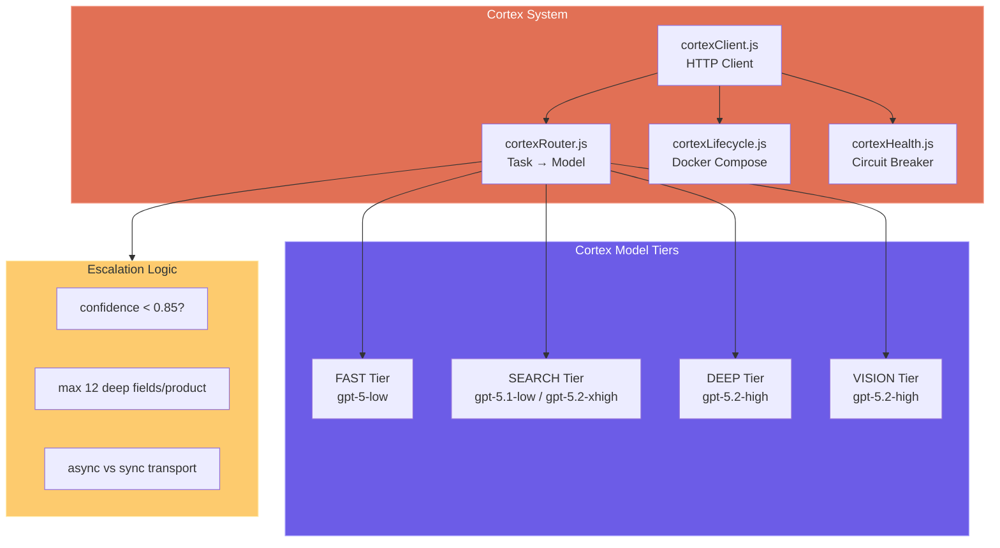

# LLM Integration Audit — 2026-03-17

> Full-stack audit of all LLM usage, wiring, providers, and dependency chains across Spec Factory.

## 4K Rendered Diagrams

All diagrams are also rendered as 4K PNG images in [`llm-audit-images/`](./llm-audit-images/):

| # | Diagram | File |
|---|---------|------|
| 1 | Master Dependency Graph | [`01-master-dependency-graph.png`](./llm-audit-images/01-master-dependency-graph.png) |
| 2 | LLM Call Flow Sequence | [`02-call-flow-sequence.png`](./llm-audit-images/02-call-flow-sequence.png) |
| 3 | Pipeline Phases Map | [`03-pipeline-phases.png`](./llm-audit-images/03-pipeline-phases.png) |
| 4 | Provider Architecture | [`04-provider-architecture.png`](./llm-audit-images/04-provider-architecture.png) |
| 5 | Configuration Flow | [`05-config-flow.png`](./llm-audit-images/05-config-flow.png) |
| 6 | Budget & Cost Flow | [`06-budget-cost-flow.png`](./llm-audit-images/06-budget-cost-flow.png) |
| 7 | Frontend Config System | [`07-frontend-config-system.png`](./llm-audit-images/07-frontend-config-system.png) |
| 8 | Resilience & Error Handling | [`08-resilience-error-handling.png`](./llm-audit-images/08-resilience-error-handling.png) |

---

## Executive Summary

Spec Factory uses LLM inference across **6 pipeline phases** with **4 provider backends**, routed through a centralized `callLlmWithRouting()` abstraction. The system supports multimodal extraction (text + images), automatic fallback chains, circuit-breaker health management, response caching, per-product/monthly budget enforcement, and a full cost ledger.

| Metric | Value |
|--------|-------|
| **Total LLM-related files** | ~75 (backend) + ~30 (frontend) |
| **Config manifest entries** | 147+ settings in `llmGroup.js` |
| **Pipeline phases with LLM** | 6 (Discovery, Planning, Triage, Extraction, Validation, Writing) |
| **LLM roles** | 4 core (`plan`, `extract`, `validate`, `write`) + 3 aliases (`fast`, `reasoning`, `triage`) |
| **Supported providers** | OpenAI, Gemini, DeepSeek, Cortex (sidecar), Ollama, ChatMock (test) |
| **Default model** | `gemini-2.5-flash-lite` (all roles) |
| **Frontend LLM config files** | 29 TypeScript files in `features/llm-config/` |
| **Test files covering LLM** | 20+ (backend) + 6 (frontend) |

---

## 1. Architecture Overview

### Master Dependency Graph

```mermaid
graph TB
    subgraph CONFIG["Configuration Layer"]
        ENV[".env / env vars"]
        MANIFEST["llmGroup.js<br/>(147 settings)"]
        DEFAULTS["settingsDefaults.js"]
        RESOLVER["llmModelResolver.js"]
        HELPERS["llmHelpers.js"]
    end

    subgraph CORE["Core LLM Infrastructure"]
        ROUTING["routing.js<br/>callLlmWithRouting()"]
        OPENAI_CLIENT["openaiClient.js<br/>callOpenAI()"]
        PROVIDERS["providers/index.js<br/>selectLlmProvider()"]
        HEALTH["providerHealth.js<br/>Circuit Breaker"]
        CACHE["llmCache.js<br/>SHA256 + SQLite"]
        HEALTH_CHECK["healthCheck.js"]
    end

    subgraph PROVIDER_IMPL["Provider Implementations"]
        OPENAI_COMPAT["openaiCompatible.js"]
        GEMINI["gemini.js"]
        DEEPSEEK["deepseek.js"]
    end

    subgraph CORTEX["Cortex Sidecar"]
        CORTEX_CLIENT["cortexClient.js"]
        CORTEX_LIFE["cortexLifecycle.js<br/>Docker Compose"]
        CORTEX_ROUTER["cortexRouter.js"]
        CORTEX_HEALTH["cortexHealth.js"]
    end

    subgraph PROMPTS["Prompt Templates"]
        P_EXTRACT["extractor.js"]
        P_PLAN["planner.js"]
        P_VALIDATE["validator.js"]
        P_BATCH["batchPromptContext.js"]
    end

    subgraph PIPELINE["Pipeline Phases (LLM Consumers)"]
        DISC_PLAN["discoveryPlanner.js<br/>Phase 2: Search Planning"]
        DISC_ADAPT["discoveryLlmAdapters.js<br/>Brand / Domain / Escalation"]
        EXTRACT["extractCandidatesLLM.js<br/>Phase 5: Field Extraction"]
        INVOKE["invokeExtractionModel.js"]
        EXEC_BATCH["executeExtractionBatch.js"]
        VALIDATE["validateCandidatesLLM.js<br/>Phase 6: Validation"]
        WRITE["writeSummaryLLM.js<br/>Phase 8: Summary"]
    end

    subgraph BILLING["Billing & Cost"]
        PRICING["modelPricingCatalog.js"]
        COST_RATES["costRates.js"]
        LEDGER["costLedger.js"]
        BUDGET["budgetGuard.js"]
    end

    subgraph RUNTIME["Runtime Tracking"]
        LLM_RUNTIME["createRunLlmRuntime.js"]
        LLM_TRACKER["runtimeBridgeLlmTracker.js"]
        BRIDGE["runtimeBridge.js"]
    end

    subgraph GUI["Frontend (TypeScript + React)"]
        CONFIG_PAGE["LlmConfigPage.tsx"]
        REGISTRY_SEC["LlmProviderRegistrySection"]
        PHASE_SEC["LlmPhaseSection"]
        EXTRACT_SEC["LlmExtractionSection"]
        GLOBAL_SEC["LlmGlobalSection"]
        CATALOG_SEC["LlmModelCatalogSection"]
        DASHBOARD["LlmCallsDashboard.tsx"]
        BILLING_PAGE["BillingPage.tsx"]
    end

    %% Config flow
    ENV --> MANIFEST
    MANIFEST --> DEFAULTS
    MANIFEST --> RESOLVER
    RESOLVER --> HELPERS
    HELPERS --> ROUTING

    %% Core flow
    ROUTING --> OPENAI_CLIENT
    OPENAI_CLIENT --> PROVIDERS
    PROVIDERS --> OPENAI_COMPAT
    PROVIDERS --> GEMINI
    PROVIDERS --> DEEPSEEK
    ROUTING --> HEALTH
    OPENAI_CLIENT --> HEALTH

    %% Cortex flow
    CORTEX_CLIENT --> CORTEX_LIFE
    CORTEX_CLIENT --> CORTEX_ROUTER
    CORTEX_CLIENT --> CORTEX_HEALTH

    %% Pipeline consumers
    DISC_PLAN --> ROUTING
    DISC_ADAPT --> ROUTING
    EXTRACT --> INVOKE
    INVOKE --> ROUTING
    INVOKE --> CACHE
    EXEC_BATCH --> INVOKE
    EXEC_BATCH --> CACHE
    VALIDATE --> ROUTING
    WRITE --> ROUTING

    %% Prompts feed pipeline
    P_EXTRACT --> EXTRACT
    P_PLAN --> DISC_PLAN
    P_VALIDATE --> VALIDATE
    P_BATCH --> EXTRACT

    %% Billing
    COST_RATES --> OPENAI_CLIENT
    PRICING --> COST_RATES
    LEDGER --> LLM_RUNTIME
    BUDGET --> LLM_RUNTIME
    BUDGET --> EXEC_BATCH
    BUDGET --> WRITE

    %% Runtime
    LLM_RUNTIME --> COST_RATES
    LLM_RUNTIME --> LEDGER
    LLM_TRACKER --> BRIDGE

    %% GUI
    CONFIG_PAGE --> REGISTRY_SEC
    CONFIG_PAGE --> PHASE_SEC
    CONFIG_PAGE --> EXTRACT_SEC
    CONFIG_PAGE --> GLOBAL_SEC
    CONFIG_PAGE --> CATALOG_SEC
    DASHBOARD --> LLM_TRACKER

    style CONFIG fill:#1a1a2e,stroke:#e94560,color:#fff
    style CORE fill:#16213e,stroke:#0f3460,color:#fff
    style PROVIDER_IMPL fill:#0f3460,stroke:#533483,color:#fff
    style CORTEX fill:#533483,stroke:#e94560,color:#fff
    style PROMPTS fill:#1a1a2e,stroke:#e94560,color:#fff
    style PIPELINE fill:#16213e,stroke:#0f3460,color:#fff
    style BILLING fill:#0f3460,stroke:#e94560,color:#fff
    style RUNTIME fill:#533483,stroke:#0f3460,color:#fff
    style GUI fill:#1a1a2e,stroke:#533483,color:#fff
```



---

## 2. LLM Call Flow (Request Lifecycle)



---

## 3. Pipeline Phase Map (Where LLM Fires)

```mermaid
graph LR
    subgraph PHASE0["Phase 0: Bootstrap"]
        B0["createRunLlmRuntime()"]
    end

    subgraph PHASE2["Phase 2: Discovery"]
        B2A["discoveryPlanner.js<br/>role: plan"]
        B2B["brandResolver<br/>role: triage"]
        B2C["domainSafetyGate<br/>role: triage"]
        B2D["escalationPlanner<br/>role: plan"]
    end

    subgraph PHASE5["Phase 5: Extraction"]
        B5A["extractCandidatesLLM.js<br/>role: extract"]
        B5B["invokeExtractionModel.js"]
        B5C["executeExtractionBatch.js"]
        B5D["runExtractionVerification.js"]
    end

    subgraph PHASE6["Phase 6: Validation"]
        B6A["validateCandidatesLLM.js<br/>role: validate"]
        B6B["validateEnumConsistency.js"]
    end

    subgraph PHASE8["Phase 8: Finalization"]
        B8["writeSummaryLLM.js<br/>role: write"]
    end

    PHASE0 --> PHASE2
    PHASE2 --> PHASE5
    PHASE5 --> PHASE6
    PHASE6 --> PHASE8

    style PHASE0 fill:#2d3436,stroke:#636e72,color:#dfe6e9
    style PHASE2 fill:#0984e3,stroke:#74b9ff,color:#fff
    style PHASE5 fill:#d63031,stroke:#ff7675,color:#fff
    style PHASE6 fill:#e17055,stroke:#fab1a0,color:#fff
    style PHASE8 fill:#00b894,stroke:#55efc4,color:#fff
```



### Phase Details

| Phase | Files | LLM Role | Reason Tag | Purpose |
|-------|-------|----------|------------|---------|
| **0 - Bootstrap** | `createRunLlmRuntime.js` | — | — | Creates LLM context, budget guard, cost rates |
| **2 - Discovery** | `discoveryPlanner.js` | `plan` | `discovery_planner` | Generate targeted search queries for missing fields |
| **2 - Discovery** | `discoveryLlmAdapters.js` | `triage` | `brand_resolution` | Resolve official brand domain + aliases |
| **2 - Discovery** | `discoveryLlmAdapters.js` | `triage` | `domain_safety_classification` | Classify domains (manufacturer, retail, malware, etc.) |
| **2 - Discovery** | `discoveryLlmAdapters.js` | `plan` | `escalation_planner` | Plan escalation queries for missing fields |
| **5 - Extraction** | `extractCandidatesLLM.js` | `extract` | `extract_candidates` | Parse evidence snippets → field candidates (multimodal) |
| **5 - Extraction** | `runExtractionVerification.js` | `extract` | `verify_extraction` | Re-check extraction results |
| **6 - Validation** | `validateCandidatesLLM.js` | `validate` | `validate_candidates` | Accept/reject/escalate conflicting candidates |
| **6 - Validation** | `validateEnumConsistency.js` | `validate` | `validate_enum` | Check component variance constraints |
| **8 - Finalize** | `writeSummaryLLM.js` | `write` | `write` | Generate markdown summary of extracted specs |

---

## 4. Provider Architecture



### Provider Endpoints & Models

| Provider | Base URL | Default Models | API Format |
|----------|----------|---------------|------------|
| **Gemini** | `generativelanguage.googleapis.com/v1beta/openai` | `gemini-2.5-flash-lite` | OpenAI-compatible |
| **OpenAI** | `api.openai.com` | GPT-5 family | Native |
| **DeepSeek** | `api.deepseek.com` | `deepseek-chat`, `deepseek-reasoner` | OpenAI-compatible |
| **Cortex** | `localhost:PORT` | `gpt-5-low`, `gpt-5.2-high` | Custom (Docker sidecar) |
| **Ollama** | `localhost:11434` | User-configured | OpenAI-compatible |
| **ChatMock** | Local filesystem | N/A | Test only |

### Model Inference Logic

```
Model name contains "gemini"  → Gemini provider
Model name contains "deepseek" → DeepSeek provider
Config baseUrl contains "deepseek" → DeepSeek provider
Env key is DEEPSEEK_API_KEY → DeepSeek provider
Otherwise → OpenAI-compatible provider
```

---

## 5. Configuration Flow



### 147 Configuration Settings (Key Groups)

| Group | Count | Examples |
|-------|-------|---------|
| **Model Selection** | ~14 | `LLM_MODEL_PLAN`, `LLM_MODEL_EXTRACT`, `LLM_MODEL_VALIDATE`, `LLM_MODEL_WRITE`, `LLM_MODEL_FAST`, `LLM_MODEL_REASONING`, `LLM_MODEL_TRIAGE` + fallbacks |
| **Per-Role Provider** | ~16 | `LLM_[ROLE]_PROVIDER`, `LLM_[ROLE]_BASE_URL`, `LLM_[ROLE]_API_KEY` for each role |
| **Token Limits** | ~12 | `LLM_MAX_OUTPUT_TOKENS_*`, `LLM_EXTRACT_MAX_TOKENS`, `LLM_REASONING_BUDGET` |
| **Cost & Budget** | ~15 | `LLM_MONTHLY_BUDGET_USD`, `LLM_PER_PRODUCT_BUDGET_USD`, `LLM_COST_INPUT_PER_1M`, per-provider rates |
| **Cortex** | ~15 | `CORTEX_ENABLED`, `CORTEX_BASE_URL`, `CORTEX_MODEL_*`, `CORTEX_ASYNC_*`, `CORTEX_ESCALATE_*` |
| **Caching** | ~4 | `LLM_EXTRACTION_CACHE_ENABLED`, `LLM_EXTRACTION_CACHE_TTL_MS`, `LLM_EXTRACTION_CACHE_DIR` |
| **Verification** | ~5 | `LLM_VERIFY_MODE`, `LLM_VERIFY_SAMPLE_RATE`, `LLM_VERIFY_AGGRESSIVE_*` |
| **Reasoning** | ~4 | `LLM_REASONING_MODE`, `LLM_REASONING_BUDGET`, `LLM_PLAN_USE_REASONING`, `LLM_TRIAGE_USE_REASONING` |
| **Batch Limits** | ~5 | `LLM_MAX_CALLS_PER_ROUND`, `LLM_MAX_CALLS_PER_PRODUCT_TOTAL`, `LLM_EXTRACT_MAX_SNIPPETS_PER_BATCH` |
| **Phase Overrides** | ~2 | `LLM_PHASE_OVERRIDES_JSON`, `LLM_PROVIDER_REGISTRY_JSON` |
| **API Keys** | ~10 | `OPENAI_API_KEY`, `GEMINI_API_KEY`, `DEEPSEEK_API_KEY`, `ANTHROPIC_API_KEY`, per-role keys |

---

## 6. Budget & Cost Enforcement



### Cost Flow Per LLM Call

```
1. Feature calls budgetGuard.canCall({ reason, essential })
   → Checks: monthly spent < $300, product spent < $0.35, round calls < 5
   → If budget exhausted & essential=false: skip call
   → If budget exhausted & essential=true: error

2. openaiClient receives API response with usage { prompt_tokens, completion_tokens }
   → If missing: estimateTokensFromText(prompt + response)
   → computeLlmCostUsd(usage, rates) → costUsd

3. Feature calls recordUsage(usageRow):
   → budgetGuard.recordCall({ costUsd })
   → appendCostLedgerEntry({ ts, provider, model, tokens, cost, reason, ... })
   → Write to JSONL + monthly rollup
```

---

## 7. Caching Architecture



---

## 8. Frontend LLM Configuration System



### 7 LLM Phases in the GUI

| Phase ID | Label | Roles | Shared With |
|----------|-------|-------|-------------|
| `global` | Global | plan, triage, fast, reasoning | — |
| `needset` | NeedSet Planner | plan | search-planner |
| `brand-resolver` | Brand Resolver | triage | serp-triage, domain-classifier |
| `search-planner` | Search Planner | plan | needset |
| `serp-triage` | SERP Triage | triage | brand-resolver, domain-classifier |
| `domain-classifier` | Domain Classifier | triage | brand-resolver, serp-triage |
| `extraction` | Extraction | extract, validate, write | — |

---

## 9. Resilience & Error Handling

```mermaid
graph TD
    subgraph CIRCUIT["Circuit Breaker (providerHealth.js)"]
        CB_CLOSED["CLOSED<br/>Accept requests"]
        CB_HALF["HALF_OPEN<br/>Test recovery"]
        CB_OPEN["OPEN<br/>Reject (60s cooldown)"]
    end

    subgraph FALLBACK["Fallback Strategy"]
        F1["Primary model fails"]
        F2["Try fallback model<br/>(if configured)"]
        F3["Retry without JSON schema<br/>(if format unsupported)"]
    end

    subgraph JSON_PARSE["JSON Recovery"]
        J1["Direct JSON.parse"]
        J2["Extract from code block"]
        J3["Balanced-brace extraction"]
        J4["Best-score selection"]
    end

    subgraph BUDGET_GUARD["Budget Protection"]
        BG1["essential=true<br/>→ hard error"]
        BG2["essential=false<br/>→ skip gracefully"]
    end

    CB_CLOSED -->|"5 failures"| CB_OPEN
    CB_OPEN -->|"60s cooldown"| CB_HALF
    CB_HALF -->|"success"| CB_CLOSED
    CB_HALF -->|"failure"| CB_OPEN

    F1 --> F2
    F2 --> F3

    J1 -->|"fail"| J2
    J2 -->|"fail"| J3
    J3 -->|"fail"| J4

    style CIRCUIT fill:#d63031,stroke:#ff7675,color:#fff
    style FALLBACK fill:#e17055,stroke:#fab1a0,color:#fff
    style JSON_PARSE fill:#fdcb6e,stroke:#ffeaa7,color:#2d3436
    style BUDGET_GUARD fill:#0984e3,stroke:#74b9ff,color:#fff
```



---

## 10. Cortex Sidecar Architecture



---

## 11. Complete File Inventory

### Core Infrastructure (`src/core/llm/`)

| File | LOC~ | Purpose |
|------|------|---------|
| `client/routing.js` | 400+ | Central routing — `callLlmWithRouting()`, fallback chains |
| `client/openaiClient.js` | 500+ | OpenAI-compatible HTTP client, multimodal, retry, cost |
| `client/llmCache.js` | 200+ | SHA256 cache (SQLite + filesystem) |
| `client/healthCheck.js` | 100+ | Pre-run connectivity test |
| `client/providerHealth.js` | 150+ | Circuit breaker state machine |
| `providers/index.js` | 50 | Provider factory (selectLlmProvider) |
| `providers/openaiCompatible.js` | 100+ | Generic OpenAI POST wrapper |
| `providers/gemini.js` | 50 | Gemini → OpenAI-compatible adapter |
| `providers/deepseek.js` | 50 | DeepSeek → OpenAI-compatible adapter |
| `cortex/cortexClient.js` | 200+ | Docker sidecar HTTP client |
| `cortex/cortexLifecycle.js` | 150+ | Docker Compose start/stop |
| `cortex/cortexRouter.js` | 150+ | Task-to-model assignment + escalation |
| `cortex/cortexHealth.js` | 100+ | Cortex circuit breaker |
| `prompts/extractor.js` | 100+ | Extraction prompt builder |
| `prompts/planner.js` | 100+ | Search planning prompt builder |
| `prompts/validator.js` | 100+ | Validation prompt builder |

### Pipeline Consumers (`src/features/indexing/`)

| File | LOC~ | Phase | LLM Role |
|------|------|-------|----------|
| `discovery/discoveryPlanner.js` | 200+ | 2 | plan |
| `discovery/discoveryLlmAdapters.js` | 300+ | 2 | triage, plan |
| `discovery/brandResolver.js` | 100+ | 2 | triage |
| `discovery/domainSafetyGate.js` | 100+ | 2 | triage |
| `discovery/escalationPlanner.js` | 100+ | 2 | plan |
| `extraction/extractCandidatesLLM.js` | 2000+ | 5 | extract |
| `extraction/invokeExtractionModel.js` | 200+ | 5 | extract |
| `extraction/executeExtractionBatch.js` | 200+ | 5 | extract |
| `extraction/batchEvidenceSelection.js` | 200+ | 5 | — |
| `extraction/batchPromptContext.js` | 200+ | 5 | — |
| `extraction/runExtractionVerification.js` | 150+ | 5 | extract |
| `extraction/sanitizeExtractionResult.js` | 200+ | 5 | — |
| `extraction/fieldBatching.js` | 200+ | 5 | — |
| `validation/validateCandidatesLLM.js` | 200+ | 6 | validate |
| `validation/validateEnumConsistency.js` | 150+ | 6 | validate |
| `orchestration/finalize/writeSummaryLLM.js` | 150+ | 8 | write |

### Billing (`src/billing/`)

| File | Purpose |
|------|---------|
| `modelPricingCatalog.js` | Hardcoded per-model pricing (GPT-5, Gemini 2.5, DeepSeek) |
| `costRates.js` | Normalize pricing, estimate tokens, compute cost |
| `costLedger.js` | Persist cost entries (JSONL + monthly rollups) |
| `budgetGuard.js` | Enforce per-product and monthly budget limits |

### Configuration

| File | Purpose |
|------|---------|
| `src/core/config/manifest/llmGroup.js` | 147 LLM setting definitions (SSOT) |
| `src/shared/settingsDefaults.js` | Default values for all settings |
| `src/core/config/llmModelResolver.js` | Provider inference from model name |
| `src/api/helpers/llmHelpers.js` | Role defaults, knob resolution, phase classification |

### Frontend (`tools/gui-react/src/features/llm-config/`)

| File | Purpose |
|------|---------|
| `components/LlmConfigPage.tsx` | Main orchestrator (442 LOC) |
| `components/LlmConfigPageShell.tsx` | Layout shell with sidebar nav |
| `components/ModelRoleBadge.tsx` | Role badge renderer |
| `sections/LlmGlobalSection.tsx` | Global settings (budget, timeout, cache) |
| `sections/LlmPhaseSection.tsx` | Per-phase override UI |
| `sections/LlmExtractionSection.tsx` | Extract/Validate/Write config |
| `sections/LlmProviderRegistrySection.tsx` | Provider CRUD |
| `sections/LlmModelCatalogSection.tsx` | Model catalog table |
| `sections/LlmAllModelsSection.tsx` | Flattened model list |
| `state/llmProviderRegistryBridge.ts` | Registry JSON bridge |
| `state/llmDefaultProviderRegistry.ts` | Default provider merge |
| `state/llmProviderApiKeyGate.ts` | API key availability |
| `state/llmPhaseOverridesBridge.ts` | Phase override JSON bridge |
| `state/llmPhaseRegistry.ts` | Phase metadata definitions |
| `state/llmModelDropdownOptions.ts` | Dropdown option builder |
| `state/llmModelCatalog.ts` | Catalog builder |
| `state/llmTokenLimitValidation.ts` | Token limit validation |
| `state/llmMixDetection.ts` | 9 config issue detectors |
| `state/llmRoleBadgeStyles.ts` | Role badge styling |
| `state/llmProviderOptions.ts` | Provider dropdown options |
| `types/llmPhaseTypes.ts` | Phase type definitions |
| `types/llmProviderRegistryTypes.ts` | Provider/model types |
| `types/llmPhaseOverrideTypes.ts` | Override types |

### Frontend (Other LLM-Related)

| File | Purpose |
|------|---------|
| `features/runtime-ops/panels/workers/LlmCallsDashboard.tsx` | Runtime LLM call metrics |
| `features/runtime-ops/selectors/llmModelHelpers.ts` | Model name abbreviation + styling |
| `features/pipeline-settings/state/llmSettingsAuthority.ts` | LLM route settings mutations |
| `features/pipeline-settings/components/LlmConfigWarningBanner.tsx` | Missing config alert |
| `features/indexing/selectors/indexingLlmConfigSelectors.ts` | Model/token/pricing derivations |
| `features/indexing/selectors/indexingLlmModelDerivations.ts` | Memoized derivation hook |
| `features/indexing/api/indexingRunLlmSettingsPayload.ts` | Run payload builder |
| `stores/llmSettingsManifest.ts` | LLM route presets (fast/balanced/deep) |
| `stores/llmSettingsAuthority.ts` | Re-export bridge |
| `types/llmSettings.ts` | LLM route row types (30+ fields) |
| `pages/billing/BillingPage.tsx` | Cost breakdown UI |

---

## 12. Key Architectural Observations

### Strengths
1. **Single routing bottleneck** — Every LLM call flows through `callLlmWithRouting()`, making tracing, cost tracking, and provider switching trivial.
2. **Provider abstraction** — All providers implement the same OpenAI-compatible interface; adding a new provider is a thin adapter.
3. **Budget enforcement is multi-layered** — Monthly, per-product, per-round, per-product-total limits prevent runaway costs.
4. **Caching is content-addressed** — SHA256 of model+prompt+evidence means identical inputs never re-call the API.
5. **Circuit breaker prevents cascading failures** — Unhealthy providers are isolated automatically.
6. **Frontend is fully type-safe** — 23 TypeScript type definitions cover every LLM config surface.

### Areas to Watch
1. **`extractCandidatesLLM.js` at 2,000+ LOC** — Largest LLM consumer file; prime candidate for further decomposition.
2. **`llmGroup.js` at 147 entries** — Configuration surface is very large; consider grouping/namespacing for discoverability.
3. **Cortex sidecar is Docker-dependent** — Requires Docker Compose for local LLM inference; adds deployment complexity.
4. **Anthropic provider configured but unused** — API key defined but no dedicated provider adapter (would route through OpenAI-compatible).
5. **Phase override key naming** — GUI uses hyphenated IDs (`brand-resolver`) while overrides use camelCase (`brandResolver`); bridging logic required.

---

*Generated 2026-03-17 — Spec Factory LLM Integration Audit*
